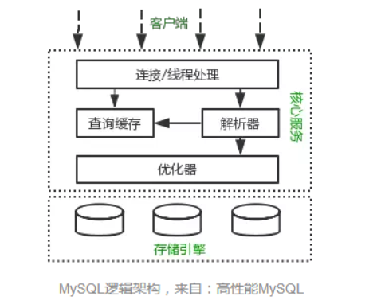
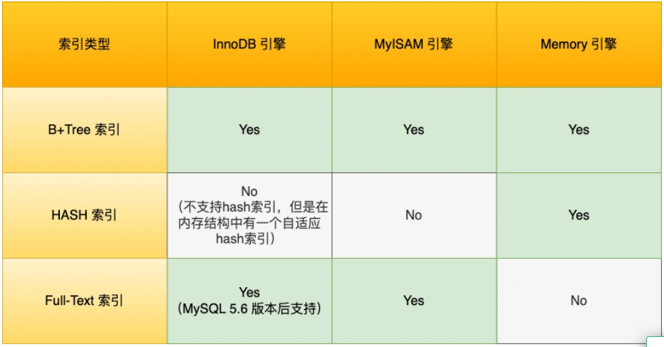
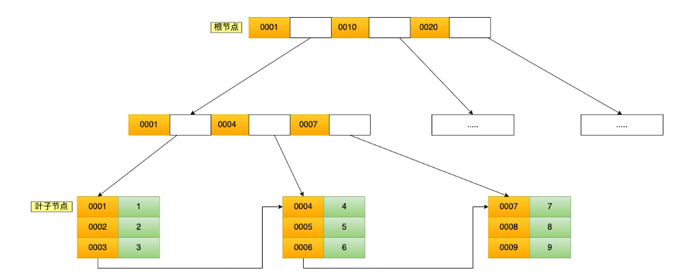
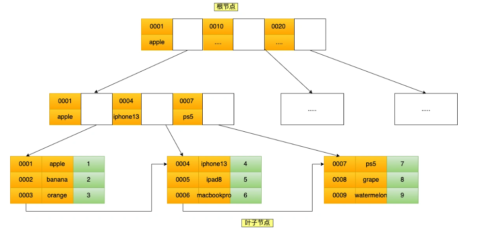

## 什么是索引

> 索引是为了减少数据库的磁盘IO次数而提出的一种数据结构

当你想查阅书中某个知识的内容，你会选择一页一页的找呢？还是在书的目录去找呢？

傻瓜都知道时间是宝贵的，当然是选择在书的目录去找，找到后再翻到对应的页。书中的<font color='blue'>**目录**</font>，就是充当<font color='blue'>**索引**</font>的角色，方便我们快速查找书中的内容，所以索引是以空间换时间的设计思想。

那换到数据库中，索引的定义就是帮助存储引擎快速获取数据的一种数据结构，形象的说就是<font color='blue'>**索引是数据的目录**</font>。

所谓的存储引擎，说白了就是如何存储数据、如何为存储的数据建立索引和如何更新、查询数据等技术的实现方法。MySQL 存储引擎有 MyISAM 、InnoDB、Memory，其中 InnoDB 是在 MySQL 5.5 之后成为默认的存储引擎。

下图是 MySQL 的结构图，索引和数据就是位于存储引擎中：




## 索引的分类

你知道索引有哪些吗？大家肯定都能霹雳啪啦地说出聚簇索引、主键索引、二级索引、普通索引、唯一索引、hash索引、B+树索引等等。

然后再问你，你能将这些索引分一下类吗？可能大家就有点模糊了。其实，要对这些索引进行分类，要清楚这些索引的使用和实现方式，然后再针对有相同特点的索引归为一类。

我们可以按照四个角度来分类索引。

- 按 【 数据结构 】分类： <font color='blue'>**B+tree索引、Hash索引、Full-text索引**</font>
- 按 【物理存储】分类：<font color='blue'>**聚簇索引（主键索引）、二级索引（辅助索引）**</font>
- 按 【字段特性】 分类：<font color='blue'>**主键索引、唯一索引、普通索引、前缀索引**</font>
- 按  【字段个数】分类：<font color='blue'>**单列索引、联合索引**</font>

接下来，按照这些角度来说说各类索引的特点。

### 一、按数据结构分类

从数据结构的角度来看，MySQL 常见索引有 B+Tree 索引、HASH 索引、Full-Text 索引。

每一种存储引擎支持的索引类型不一定相同，我在表中总结了 MySQL 常见的存储引擎 InnoDB、MyISAM 和 Memory 分别支持的索引类型。



InnoDB是在MySQL 5.5 之后成为默认的MySQL存储引擎，B+Tree索引类型也是 MySQL 存储引擎最多的索引类型。

在创建表时，InnoDB 存储引擎会根据不同的场景选择不同的列作为索引：

- 如果有主键，默认会使用主键作为聚簇索引的索引键（key）；
- 如果没有主键，就选择第一个不包含 NULL 值的唯一列作为聚簇索引的索引键（key）；
- 在上面两个都没有的情况下，InnoDB 将自动生成一个隐式自增 id 列作为聚簇索引的索引键（key）；

其它索引都属于辅助索引（Secondary Index），也被称为二级索引或非聚簇索引。<font color='blue'>**创建的主键索引和二级索引默认使用的是 B+Tree 索引**</font>。

B+Tree是一种多叉树，叶子节点才存放数据，非叶子节点只存放索引，而且每个节点里的数据是<font color='blue'>**按主键顺序存放**</font>的。每一层的父节点的索引值都会出现在下层子节点的索引值中，因此在叶子节点中，包括了所有的索引值信息，并且每一个叶子节点都有两个指针，分别指向下一个叶子节点和上一个叶子节点，形成一个双向链表。

#### 通过主键索引查询商品数据的过程

比如，我们执行了下面这条查询语句：

```sql
select * from product where id= 5;
```

这条语句使用了主键索引查询 id 号为 5 的商品。查询过程是这样的，B+Tree 会自顶向下逐层进行查找：

- 将 5 与根节点的索引数据 (1，10，20) 比较，5 在 1 和 10 之间，所以根据 B+Tree的搜索逻辑，找到第二层的索引数据 (1，4，7)；
- 在第二层的索引数据 (1，4，7)中进行查找，因为 5 在 4 和 7 之间，所以找到第三层的索引数据（4，5，6）；
- 在叶子节点的索引数据（4，5，6）中进行查找，然后我们找到了索引值为 5 的行数据。

数据库的索引和数据都是存储在硬盘的，我们可以把读取一个节点当作一次磁盘 I/O 操作。那么上面的整个查询过程一共经历了 3 个节点，也就是进行了 3 次 I/O 操作。

B+Tree 存储千万级的数据只需要 3-4 层高度就可以满足，这意味着从千万级的表查询目标数据最多需要 3-4 次磁盘 I/O，所以<font color='blue'>**B+Tree 相比于 B 树和二叉树来说，最大的优势在于查询效率很高，因为即使在数据量很大的情况，查询一个数据的磁盘 I/O 依然维持在 3-4次。**</font>

#### 通过二级索引查询商品数据的过程

主键索引的B+Tree和二级索引的B+Tree区别如下：

- 主键索引的 B+Tree 的叶子节点存放的是实际数据，所有完整的用户记录都存放在主键索引的 B+Tree 的叶子节点里；
- 二级索引的 B+Tree 的叶子节点存放的是主键值，而不是实际数据。

如图，二级索引就是存储的**主键ID值**




<font color='blue'>**回表: 就是通过二级索引找到主键ID值然后通过id值去聚簇索引找到自己想要的数据**</font>

<font color='blue'>**这种在二级索引的 B+Tree 就能查询到结果的过程就叫作「覆盖索引」，也就是只需要查一个 B+Tree 就能找到数据。**</font>

#### 为什么MySQL InnoDB选择B+Tree作为索引的数据结构？

前面已经讲了 B+Tree 的索引原理，现在就来回答一下 B+Tree 相比于 B 树、二叉树或 Hash 索引结构的优势在哪儿？

***1、B+Tree vs B Tree***

B+Tree 只在叶子节点存储数据，而 B 树 的非叶子节点也要存储数据，所以 B+Tree 的单个节点的数据量更小，在相同的磁盘 I/O 次数下，就能查询更多的节点。

另外，B+Tree 叶子节点采用的是双链表连接，适合 MySQL 中常见的基于范围的顺序查找，而 B 树无法做到这一点。

***2、B+Tree vs 二叉树***

对于有 N 个叶子节点的 B+Tree，其搜索复杂度为`O(logdN)`，其中 d 表示节点允许的最大子节点个数为 d 个。

在实际的应用当中， d 值是大于100的，这样就保证了，即使数据达到千万级别时，B+Tree 的高度依然维持在 3~4 层左右，也就是说一次数据查询操作只需要做 3~4 次的磁盘 I/O 操作就能查询到目标数据。

而二叉树的每个父节点的儿子节点个数只能是 2 个，意味着其搜索复杂度为 `O(logN)`，这已经比 B+Tree 高出不少，因此二叉树检索到目标数据所经历的磁盘 I/O 次数要更多。

***3、B+Tree vs Hash***

Hash 在做等值查询的时候效率贼快，搜索复杂度为 O(1)。

但是 Hash 表不适合做范围查询，它更适合做等值的查询，这也是 B+Tree 索引要比 Hash 表索引有着更广泛的适用场景的原因。


### 二、按物理存储分类

从物理存储的角度来看，索引分为聚簇索引（主键索引）、二级索引（辅助索引）。

这两个区别在前面也提到了：

- 主键索引的 B+Tree 的叶子节点存放的是实际数据，所有完整的用户记录都存放在主键索引的 B+Tree 的叶子节点里；
- 二级索引的 B+Tree 的叶子节点存放的是主键值，而不是实际数据。

所以，在查询时使用了二级索引，如果查询的数据能在二级索引里查询的到，那么就不需要回表，这个过程就是覆盖索引。如果查询的数据不在二级索引里，就会先检索二级索引，找到对应的叶子节点，获取到主键值后，然后再检索主键索引，就能查询到数据了，这个过程就是回表。


### 三、按字段特性分类

从字段特性的角度来看，索引分为**主键索引、唯一索引、普通索引、前缀索引**。


<font color='red'>***1、主键索引***</font>

主键索引就是建立在主键字段上的所有，通常在创建表的时候一起创建，一张表最多只有一个主键索引，索引列的值不允许又空值。

在创建表时，创建主键索引的方式如下：

```sql
CREATE TABLE table_name  (
  ....
  PRIMARY KEY (index_column_1) USING BTREE
);
```

<font color='red'>***2、唯一索引***</font>

唯一索引建立在 UNIQUE 字段上的索引，一张表可以有多个唯一索引，索引列的值必须唯一，但是允许有空值。

在创建表时，创建唯一索引的方式如下：

```sql
CREATE TABLE table_name  (
  ....
  UNIQUE KEY(index_column_1,index_column_2,...) 
);
```

建表后，如果要创建唯一索引，可以使用这面这条命令：

```sql
CREATE UNIQUE INDEX index_name
ON table_name(index_column_1,index_column_2,...); 
```

<font color='red'>***3、普通索引***</font>

普通索引就是建立在普通字段上的索引，既不要求字段为主键，也不要求字段为 UNIQUE。

在创建表时，创建普通索引的方式如下：

```sql
CREATE TABLE table_name  (
  ....
  INDEX(index_column_1,index_column_2,...) 
);
```

建表后，如果要创建普通索引，可以使用这面这条命令：

```sql
CREATE INDEX index_name
ON table_name(index_column_1,index_column_2,...); 
```

<font color='red'>***4、前缀索引***</font>

前缀索引是指对字符类型字段的前几个字符建立的索引，而不是在整个字段上建立的索引，前缀索引可以建立在字段类型为 char、 varchar、binary、varbinary 的列上。

使用前缀索引的目的是为了减少索引占用的存储空间，提升查询效率。

在创建表时，创建前缀索引的方式如下：

```sql
CREATE TABLE table_name(
    column_list,
    INDEX(column_name(length))
); 
```

建表后，如果要创建前缀索引，可以使用这面这条命令：

```sql
CREATE INDEX index_name
ON table_name(column_name(length));
```


### 四、按字段个数分类

从字段个数的角度来看，索引分为单列索引、联合索引（复合索引）。

- 建立在单列上的索引称为单列索引，比如主键索引；
- 建立在多列上的索引称为联合索引；

**联合索引**

通过将多个字段组合成一个索引，该索引就被称为联合索引。

比如，将商品表中的 product_no 和 name 字段组合成联合索引`(product_no, name)`，创建联合索引的方式如下：

```sql
CREATE INDEX index_product_no_name ON product(product_no, name);
```

如图：



在使用联合索引时，存在<font color='blue'>**最左匹配原则**</font>，也就是按照最左优先的方式进行索引的匹配。

比如，如果创建了一个 `(a, b, c)` 联合索引，如果查询条件是以下这几种，就可以匹配上联合索引：

- where a=1；
- where a=1 and b=2 and c=3；
- where a=1 and b=2；

**需要注意的是，因为有查询优化器，所以 a 字段在 where 子句的顺序并不重要。**

但是，如果查询条件是以下这几种，因为不符合最左匹配原则，所以就无法匹配上联合索引，联合索引就会失效:

- where b=2；
- where c=3；
- where b=2 and c=3；

上面这些查询条件之所以会失效，是因为`(a, b, c)` 联合索引，是先按 a 排序，在 a 相同的情况再按 b 排序，在 b 相同的情况再按 c 排序。所以，<font color='blue'>**b 和 c 是全局无序，局部相对有序的**</font>，这样在没有遵循最左匹配原则的情况下，是无法利用到索引的。

<font color='blue'>**利用索引的前提是索引里的key是有序的**</font>

联合索引有一些特殊情况，**并不是查询过程使用了联合索引查询，就代表联合索引中的所有字段都用到了联合索引进行索引查询**，也就是可能存在部分字段用到联合索引的 B+Tree，部分字段没有用到联合索引的 B+Tree 的情况。

这种特殊情况就发生在范围查询。联合索引的最左匹配原则会一直向右匹配直到遇到「范围查询」就会停止匹配。**也就是范围查询的字段可以用到联合索引，但是在范围查询字段的后面的字段无法用到联合索引**。

范围查询有很多种，那到底是哪些范围查询会导致联合索引的最左匹配原则会停止匹配呢？

接下来，举例几个范围查例子。

> Q1: `select * from t_table where a > 1 and b = 2`，联合索引（a, b）哪一个字段用到了联合索引的 B+Tree？

由于联合索引（二级索引）是先按照 a 字段的值排序的，所以符合 a > 1 条件的二级索引记录肯定是相邻，于是在进行索引扫描的时候，可以定位到符合 a > 1 条件的第一条记录，然后沿着记录所在的链表向后扫描，直到某条记录不符合 a > 1 条件位置。所以 a 字段可以在联合索引的 B+Tree 中进行索引查询。

**但是在符合 a > 1 条件的二级索引记录的范围里，b 字段的值是无序的**。比如前面图的联合索引的 B+ Tree 里，下面这三条记录的 a 字段的值都符合 a > 1 查询条件，而 b 字段的值是无序的：

- a 字段值为 5 的记录，该记录的 b 字段值为 8；
- a 字段值为 6 的记录，该记录的 b 字段值为 10；
- a 字段值为 7 的记录，该记录的 b 字段值为 5；

因此，我们不能根据查询条件 b = 2 来进一步减少需要扫描的记录数量（b 字段无法利用联合索引进行索引查询的意思）。

所以在执行 Q1 这条查询语句的时候，对应的扫描区间是 (2, + ∞)，形成该扫描区间的边界条件是 a > 1，与 b = 2 无关。

因此，**Q1 这条查询语句只有 a 字段用到了联合索引进行索引查询，而 b 字段并没有使用到联合索引**。

我们也可以在执行计划中的 key_len 知道这一点，在使用联合索引进行查询的时候，通过 key_len 我们可以知道优化器具体使用了多少个字段的搜索条件来形成扫描区间的边界条件。

举例个例子 ，a 和 b 都是 int 类型且不为 NULL 的字段，那么 Q1 这条查询语句执行计划如下，可以看到 key_len 为 4 字节（如果字段允许为 NULL，就在字段类型占用的字节数上加 1，也就是 5 字节），说明只有 a 字段用到了联合索引进行索引查询，而且可以看到，即使 b 字段没用到联合索引，key 为 idx_a_b，说明 Q1 查询语句使用了 idx_a_b 联合索引。


通过 Q1 查询语句我们可以知道，a 字段使用了 > 进行范围查询，联合索引的最左匹配原则在遇到 a 字段的范围查询（ >）后就停止匹配了，因此 b 字段并没有使用到联合索引。

> Q2: `select * from t_table where a >= 1 and b = 2`，联合索引（a, b）哪一个字段用到了联合索引的 B+Tree？

Q2 和 Q1 的查询语句很像，唯一的区别就是 a 字段的查询条件「大于等于」。

由于联合索引（二级索引）是先按照 a 字段的值排序的，所以符合 >= 1 条件的二级索引记录肯定是相邻，于是在进行索引扫描的时候，可以定位到符合 >= 1 条件的第一条记录，然后沿着记录所在的链表向后扫描，直到某条记录不符合 a>= 1 条件位置。所以 a 字段可以在联合索引的 B+Tree 中进行索引查询。

虽然在符合 a>= 1 条件的二级索引记录的范围里，b 字段的值是「无序」的，**但是对于符合 a = 1 的二级索引记录的范围里，b 字段的值是「有序」的**（因为对于联合索引，是先按照 a 字段的值排序，然后在 a 字段的值相同的情况下，再按照 b 字段的值进行排序）。

于是，在确定需要扫描的二级索引的范围时，当二级索引记录的 a 字段值为 1 时，可以通过 b = 2 条件减少需要扫描的二级索引记录范围（b 字段可以利用联合索引进行索引查询的意思）。也就是说，从符合 a = 1 and b = 2 条件的第一条记录开始扫描，而不需要从第一个 a 字段值为 1 的记录开始扫描。

所以，**Q2 这条查询语句 a 和 b 字段都用到了联合索引进行索引查询**。

我们也可以在执行计划中的 key_len 知道这一点。执行计划如下，可以看到 key_len 为 8 字节，说明优化器使用了 2 个字段的查询条件来形成扫描区间的边界条件，也就是 a 和 b 字段都用到了联合索引进行索引查询。


通过 Q2 查询语句我们可以知道，虽然 a 字段使用了 >= 进行范围查询，但是联合索引的最左匹配原则并没有在遇到 a 字段的范围查询（ >=）后就停止匹配了，b 字段还是可以用到了联合索引的。

> Q3: `SELECT * FROM t_table WHERE a BETWEEN 2 AND 8 AND b = 2`，联合索引（a, b）哪一个字段用到了联合索引的 B+Tree？

Q3 查询条件中 `a BETWEEN 2 AND 8` 的意思是查询 a 字段的值在 2 和 8 之间的记录。不同的数据库对 BETWEEN ... AND 处理方式是有差异的。在 MySQL 中，BETWEEN 包含了 value1 和 value2 边界值，类似于 >= and =<。而有的数据库则不包含 value1 和 value2 边界值（类似于 > and <）。

这里我们只讨论 MySQL。由于 MySQL 的 BETWEEN 包含 value1 和 value2 边界值，所以类似于 Q2 查询语句，因此 **Q3 这条查询语句 a 和 b 字段都用到了联合索引进行索引查询**。

我们也可以在执行计划中的 key_len 知道这一点。执行计划如下，可以看到 key_len 为 8 字节，说明优化器使用了 2 个字段的查询条件来形成扫描区间的边界条件，也就是 a 和 b 字段都用到了联合索引进行索引查询。


通过 Q3 查询语句我们可以知道，虽然 a 字段使用了 BETWEEN 进行范围查询，但是联合索引的最左匹配原则并没有在遇到 a 字段的范围查询（ BETWEEN）后就停止匹配了，b 字段还是可以用到了联合索引的。

> Q4: `SELECT * FROM t_user WHERE name like 'j%' and age = 22`，联合索引（name, age）哪一个字段用到了联合索引的 B+Tree？

由于联合索引（二级索引）是先按照 name 字段的值排序的，所以前缀为 ‘j’ 的 name 字段的二级索引记录都是相邻的， 于是在进行索引扫描的时候，可以定位到符合前缀为 ‘j’ 的 name 字段的第一条记录，然后沿着记录所在的链表向后扫描，直到某条记录的 name 前缀不为 ‘j’ 为止。

所以 a 字段可以在联合索引的 B+Tree 中进行索引查询，形成的扫描区间是['j','k')。注意， j 是闭区间。如下图：


虽然在符合前缀为 ‘j’ 的 name 字段的二级索引记录的范围里，age 字段的值是「无序」的，**但是对于符合 name = j 的二级索引记录的范围里，age字段的值是「有序」的**（因为对于联合索引，是先按照 name 字段的值排序，然后在 name 字段的值相同的情况下，再按照 age 字段的值进行排序）。

于是，在确定需要扫描的二级索引的范围时，当二级索引记录的 name 字段值为 ‘j’ 时，可以通过 age = 22 条件减少需要扫描的二级索引记录范围（age 字段可以利用联合索引进行索引查询的意思）。也就是说，从符合 `name = 'j' and age = 22` 条件的第一条记录时开始扫描，而不需要从第一个 name 为 j 的记录开始扫描 。如下图的右边：


所以，**Q4 这条查询语句 a 和 b 字段都用到了联合索引进行索引查询**。

我们也可以在执行计划中的 key_len 知道这一点。本次例子中：

- name 字段的类型是 varchar(30) 且不为 NULL，数据库表使用了 utf8mb4 字符集，一个字符集为 utf8mb4 的字符是 4 个字节，因此 name 字段的实际数据最多占用的存储空间长度是 120 字节（30 x 4），然后因为 name 是变长类型的字段，需要再加 2 字节（用于存储该字段实际数据的长度值），也就是 name 的 key_len 为 122。
- age 字段的类型是 int 且不为 NULL，key_len 为 4。
