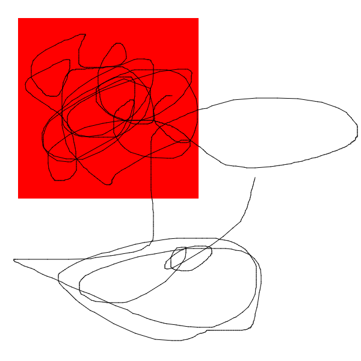
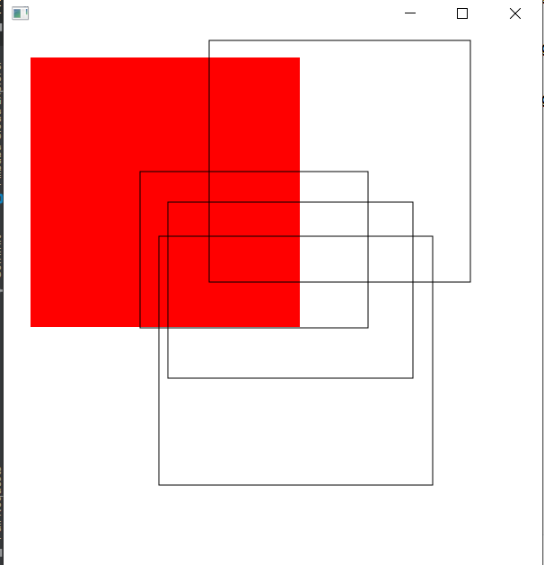
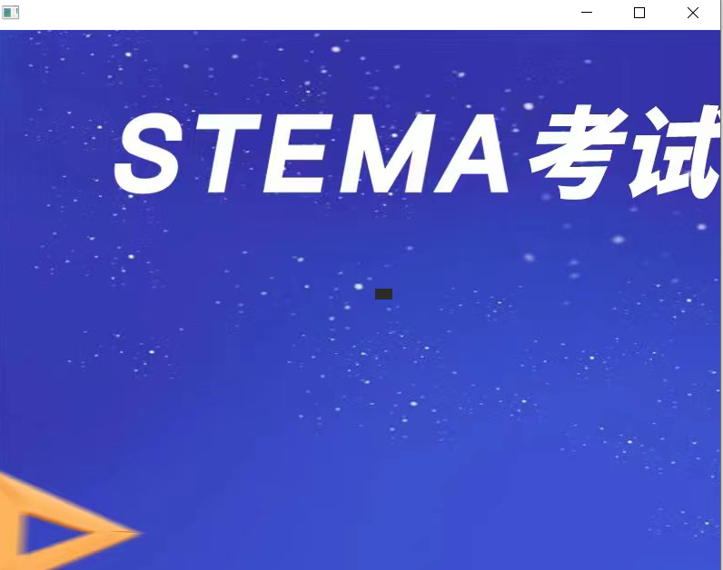

> UI方面javaFX

## 一、Canvas画布

**画布上画图**

```java
public class canvasTest extends Application {
    public static final double WIDTH=600,HEIGHT=600;
    private Canvas canvas = new Canvas(WIDTH,HEIGHT);
    private GraphicsContext graphicsContext = canvas.getGraphicsContext2D();

    private double x;
    private double y;

    public static void main(String[] args) {
        launch(args);
    }

    @Override
    public void start(Stage primaryStage) throws Exception {
        canvas.setLayoutX(0);
        canvas.setLayoutY(0);
        //鼠标按下
        canvas.setOnMousePressed(event -> {
            x = event.getX();
            y = event.getY();
        });
        //鼠标抬起
        canvas.setOnMouseDragged(event -> {
            //画线
            double x2 = event.getX();
            double y2 = event.getY();

            graphicsContext.strokeLine(x,y,x2,y2);
            x=x2;
            y=y2;
        });

        graphicsContext.setFill(Color.RED);
        graphicsContext.fillRect(30,30,300,300);
        AnchorPane root = new AnchorPane(canvas);
        Scene scene = new Scene(root);
        primaryStage.setScene(scene);
        primaryStage.show();
    }
}
```



```java
public class canvasTest extends Application {
    public static final double WIDTH=600,HEIGHT=600;
    private Canvas canvas = new Canvas(WIDTH,HEIGHT);
    private GraphicsContext graphicsContext = canvas.getGraphicsContext2D();
    private WritableImage image = null;
    private double x;
    private double y;

    public static void main(String[] args) {
        launch(args);
    }

    @Override
    public void start(Stage primaryStage) throws Exception {
        canvas.setLayoutX(0);
        canvas.setLayoutY(0);
        //鼠标按下
        canvas.setOnMousePressed(event -> {
            x = event.getX();
            y = event.getY();
        });
        //鼠标抬起
        canvas.setOnMouseDragged(event -> {
            //画线
            double startx = x;
            double starty = y;
            double endx = event.getX();
            double endy = event.getY();

            if (endx<startx){
                startx=endx;
                endx=x;
            }
            if (endy<starty){
                starty=endy;
                endy=y;
            }
            double width = endx-startx;
            double height = endy-starty;
            graphicsContext.clearRect(0,0,WIDTH,HEIGHT);
            graphicsContext.drawImage(image,0,0,WIDTH,HEIGHT);
            graphicsContext.strokeRect(startx,starty,width,height);
        });

        canvas.setOnMouseReleased(event -> {
        //获取画布快照
            image = canvas.snapshot(null, null);
        });

        graphicsContext.setFill(Color.RED);
        graphicsContext.fillRect(30,30,300,300);
        AnchorPane root = new AnchorPane(canvas);
        Scene scene = new Scene(root);
        primaryStage.setScene(scene);
        primaryStage.show();
    }
}
```



### canvas保存图片

```java
public class canvasController {

    @FXML
    private MenuItem savemune;

    @FXML
    private Canvas canvas;

    private double x;
    private double y;

    @FXML
    void canvasdragged(MouseEvent event) {
        double x2 = event.getX();
        double y2 = event.getY();
        canvas.getGraphicsContext2D().strokeLine(x,y,x2,y2);
        x=x2;
        y=y2;
    }

    @FXML
    void canvaspressed(MouseEvent event) {
        x = event.getX();
        y = event.getY();
    }

    @FXML
    void savefile(ActionEvent event) throws IOException {
    //用writeimage 接收
        WritableImage image = canvas.snapshot(null, null);
        BufferedImage bufferedImage = SwingFXUtils.fromFXImage(image,null);

        //弹出保存窗口
        FileChooser fileChooser = new FileChooser();
        fileChooser.setTitle("保存canvas图片");
        fileChooser.getExtensionFilters().addAll(new FileChooser.ExtensionFilter("PNG",".png"));
        //文件 保存
        File file = fileChooser.showSaveDialog(canvas.getScene().getWindow());

        if (file!=null){
            ImageIO.write(bufferedImage,"PNG",file);
        }

    }

}
```

```xml
<?xml version="1.0" encoding="UTF-8"?>

<?import javafx.scene.canvas.Canvas?>
<?import javafx.scene.control.Menu?>
<?import javafx.scene.control.MenuBar?>
<?import javafx.scene.control.MenuItem?>
<?import javafx.scene.layout.AnchorPane?>


<AnchorPane prefHeight="400.0" prefWidth="600.0" xmlns="http://javafx.com/javafx/8.0.171" xmlns:fx="http://javafx.com/fxml/1" fx:controller="com.lyj.hello.canvasController">
   <children>
      <MenuBar layoutX="6.0" layoutY="6.0" prefHeight="32.0" prefWidth="600.0">
        <menus>
          <Menu mnemonicParsing="false" text="文件">
            <items>
              <MenuItem fx:id="savemune" mnemonicParsing="false" onAction="#savefile" text="保存" />
            </items>
          </Menu>
          <Menu mnemonicParsing="false" text="编辑">
            <items>
              <MenuItem mnemonicParsing="false" text="Delete" />
            </items>
          </Menu>
          <Menu mnemonicParsing="false" text="帮助">
            <items>
              <MenuItem mnemonicParsing="false" text="About" />
            </items>
          </Menu>
        </menus>
      </MenuBar>
      <Canvas fx:id="canvas" height="365.0" layoutX="-1.0" layoutY="38.0" onMouseDragged="#canvasdragged" onMousePressed="#canvaspressed" width="606.0" />
   </children>
</AnchorPane>
```

```java
public class fxmlTest extends Application {
    public static void main(String[] args) {
        launch(args);
    }
    @Override
    public void start(Stage primaryStage) throws Exception {
        Pane root = FXMLLoader.load(getClass().getResource("/canvas.fxml"));
        Scene scene = new Scene(root, 500, 500);
        primaryStage.setTitle("app");
        primaryStage.setScene(scene);
        primaryStage.show();
    }
}
```

### canvas 开发小游戏

> 1.对用户的操作进行响应
>
> 2.屏幕需要进行刷新

运用animationtimer实时更新

```java
public class canvasTest extends Application {
    public static final double WIDTH=800,HEIGHT=600;
    private static Canvas canvas = new Canvas(WIDTH,HEIGHT);
    private GraphicsContext graphicsContext = canvas.getGraphicsContext2D();

    private Image background =  new Image("test.jpg");

    private Image slef = new Image("0.png");
    private double x=400;
    private double y=300;

    public static void main(String[] args) {
        launch(args);
    }

    @Override
    public void start(Stage primaryStage) throws Exception {
        update();
        AnchorPane root = new AnchorPane(canvas);
        Scene scene = new Scene(root);

        scene.setOnKeyPressed(event -> {
            KeyCode keyCode = event.getCode();

            switch (keyCode){
                case UP:
                    y-=5;
                    System.out.println(" y-=5;");
                    break;
                case DOWN:
                    y+=5;
                    System.out.println("y+=5");
                    break;
                case LEFT:
                    x-=5;
                    System.out.println("x-=5");
                    break;
                case RIGHT:
                    x+=5;
                    System.out.println(x+=5);
            }
        });
        primaryStage.setScene(scene);
        primaryStage.show();

        primaryStage.setScene(scene);
        primaryStage.show();
    }

    private void paint(){
        graphicsContext.drawImage(background,0,0);
        graphicsContext.drawImage(slef,x,y);
    }

    private void update(){
        AnimationTimer animationTimer = new AnimationTimer() {
            @Override
            public void handle(long now) {
                paint();
            }
        };
        animationTimer.start();
    }

    static {
        canvas.setLayoutX(0);
        canvas.setLayoutY(0);
    }
}
```




## 二、音视频播放

> 百度 稍微负责


## 三、Audioclip

> 制作游戏的音效