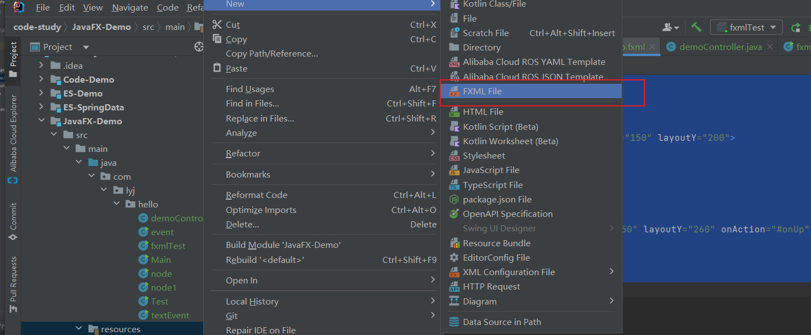

> event 事件驱动

## 一、事件驱动编程

**设置事件**

```java
public class event extends Application {

    public static void main(String[] args) {
        launch(args);
    }

    @Override
    public void start(Stage primaryStage) throws Exception {
        AnchorPane root = new AnchorPane();
        Scene scene = new Scene(root, 500, 500);

        Label label = new Label("Hello world");
        label.setLayoutX(200);
        label.setLayoutY(200);

        Button button = new Button("向上移动");
        button.setLayoutY(200);
        button.setLayoutX(300);
        root.getChildren().addAll(button,label);

        //设置事件---点击按钮
        button.setOnAction(event -> {
            label.setLayoutY(label.getLayoutY()-5);
        });
        //设置事件--键盘抬起
        scene.setOnKeyPressed(event -> {
            KeyCode code = event.getCode();
            if (code.equals(KeyCode.DOWN)){
                label.setLayoutY(label.getLayoutY()+5);
            }
        });
        primaryStage.setScene(scene);
        primaryStage.show();
    }
}
```


```java
public class textEvent extends Application {
    public static void main(String[] args) {
        launch(args);
    }

    @Override
    public void start(Stage primaryStage) throws Exception {
        AnchorPane root = new AnchorPane();
        Scene scene = new Scene(root, 500, 500);

        TextField textField = new TextField();
        textField.setLayoutX(150);
        textField.setLayoutY(200);
        //显示图标箭头
        textField.setOnDragOver(event -> {
            event.acceptTransferModes(TransferMode.ANY);
        });

        textField.setOnDragDropped(event -> {
            Dragboard dragboard = event.getDragboard();
            if (dragboard.hasFiles()){
                String path = dragboard.getFiles().get(0).getAbsolutePath();
                textField.setText(path);
            }
        });

        root.getChildren().addAll(textField);

        primaryStage.setScene(scene);
        primaryStage.show();
    }
}

```


## 二、FXML布局文件的使用

<font color='red'>**使用idea新建fxml文件**</font>



```xml
<?xml version="1.0" encoding="UTF-8"?>

<?import java.lang.*?>
<?import java.util.*?>
<?import javafx.scene.*?>
<?import javafx.scene.control.*?>
<?import javafx.scene.layout.*?>

<?import javafx.scene.text.Font?>
<AnchorPane xmlns="http://javafx.com/javafx"
            xmlns:fx="http://javafx.com/fxml"
            fx:controller="com.lyj.hello.demoController"
            prefHeight="400.0" prefWidth="600.0">

    <children>
<!--        设置一个id-->
        <Label fx:id="la" text="Hello World" layoutX="150" layoutY="200">
            <font>
                <Font size="30"/>
            </font>
        </Label>
<!--     onAction="#onUp" 绑定事件   -->
        <Button fx:id="but" text="向上移动" layoutX="150" layoutY="260" onAction="#onUp"/>

    </children>
</AnchorPane>
```

**使用JAVA代码导入fxml文件**

```java
public class fxmlTest extends Application {
    public static void main(String[] args) {
        launch(args);
    }

    @Override
    public void start(Stage primaryStage) throws Exception {
        Pane root = FXMLLoader.load(getClass().getResource("/demo.fxml"));
        Scene scene = new Scene(root, 500, 500);
        primaryStage.setScene(scene);
        primaryStage.show();
    }
}
```

**可以用注解绑定事件**

```java
public class demoController {
    @FXML
    Label la;

    @FXML
    Button but;

    public void onUp(){
        la.setLayoutY(la.getLayoutY()-5);
    }
}
```


## 三、Scene Builder 创建fxml布局文件


可以保存，导入到idea中


<font color='red'>**查看对应的controller代码**</font>


## 四、Controller的Initialize

> 加载初始数据，比如我们想在系统启动初就开始加载数据

```java
public class Controller {

    @FXML
    private TableView<Person> tableview;

    @FXML
    private TableColumn<Person, String> name;

    @FXML
    private TableColumn<Person, Integer> age;

    public void initialize(){
        ObservableList<Person> celldate = FXCollections.observableArrayList();
        name.setCellValueFactory(new PropertyValueFactory<Person,String>("name"));
        age.setCellValueFactory(new PropertyValueFactory<Person,Integer>("age"));

        celldate.add(new Person("张三",18));
        celldate.add(new Person("张三1",18));
        celldate.add(new Person("张三2",18));

        tableview.setItems(celldate);
    }
}
```

FXML

```XML
<?xml version="1.0" encoding="UTF-8"?>

<?import java.lang.*?>
<?import java.util.*?>
<?import javafx.scene.*?>
<?import javafx.scene.control.*?>
<?import javafx.scene.layout.*?>

<?import javafx.scene.text.Font?>
<AnchorPane xmlns="http://javafx.com/javafx"
            xmlns:fx="http://javafx.com/fxml"
            fx:controller="com.lyj.hello.demoController"
            prefHeight="400.0" prefWidth="600.0">

    <children>
<!--        设置一个id-->
        <Label fx:id="la" text="Hello World" layoutX="150" layoutY="200">
            <font>
                <Font size="30"/>
            </font>
        </Label>
<!--     onAction="#onUp" 绑定事件   -->
        <Button fx:id="but" text="向上移动" layoutX="150" layoutY="260" onAction="#onUp"/>

    </children>
</AnchorPane>

```

```JAVA
public class fxmlTest extends Application {
    public static void main(String[] args) {
        launch(args);
    }

    @Override
    public void start(Stage primaryStage) throws Exception {
        Pane root = FXMLLoader.load(getClass().getResource("/demo1.fxml"));
        Scene scene = new Scene(root, 500, 500);
        primaryStage.setTitle("app");
        primaryStage.setScene(scene);
        primaryStage.show();
    }
}
```

## 五、Application里面的Controller

**在JAVA主线程Application里面操作controller**

```java
public class Main extends Application {


    @Override
    public void start(Stage primaryStage) throws Exception {
        FXMLLoader fxmlLoader = new FXMLLoader();
        fxmlLoader.setLocation(getClass().getResource("/hello.fxml"));

        Parent root = fxmlLoader.load();
        Scene scene = new Scene(root);

        Controller controller = fxmlLoader.getController();
        controller.circile(scene);

        primaryStage.setTitle("hello");
        primaryStage.setScene(scene);
        primaryStage.show();;
    }

    public static void main(String[] args) {
        launch(args);
    }
}
```

## 六、多线程操作 Platform.runLater


```java
public class Main0 extends Application {
    public static void main(String[] args) {
        launch(args);
    }

    @Override
    public void start(Stage primaryStage) throws Exception {
        Label label = new Label("姓名是？");
        label.setLayoutX(200);
        label.setLayoutY(350);

        Button button = new Button("获取");
        button.setLayoutX(200);
        button.setLayoutY(400);

        button.setOnAction(event -> {
            new Thread(()->{
                //只有在队列里面才能执行任务，不报错
                Platform.runLater(()->{
                    String newValue = "lyj";
                    label.setText(newValue);
                });
            }).start();
        });


        AnchorPane pane = new AnchorPane();
        pane.getChildren().addAll(button,label);
        Scene scene = new Scene(pane, 500, 500);
        primaryStage.setScene(scene);
        primaryStage.setResizable(false);
        primaryStage.setTitle("hello");
        primaryStage.show();
    }
}
```


