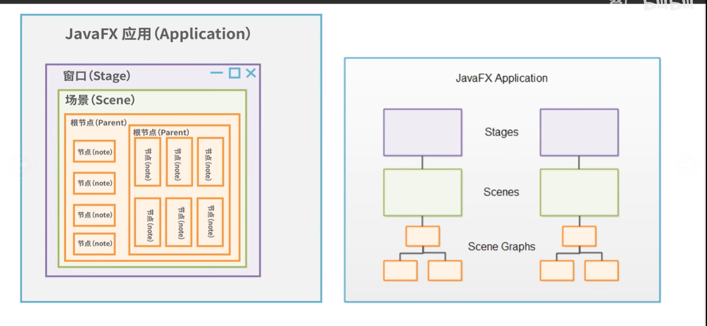
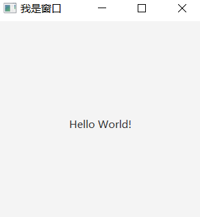
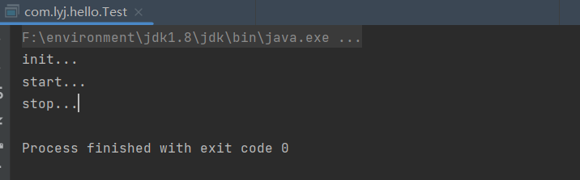
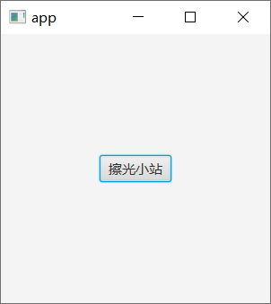
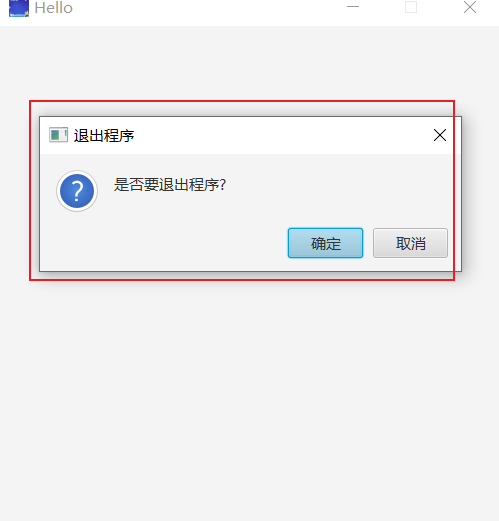

> JavaFX -----java桌面程序

## 一、JavaFX应用的程序基本结构




```java
public class Main extends Application {

    public static void main(String[] args) {
        Application.launch(args);
    }

    @Override
    public void start(Stage stage) throws Exception {
        //标签
        Label label = new Label("Hello World!");
        //border 布局 默认设置为中
        BorderPane pane = new BorderPane(label);
        //场景
        Scene scene = new Scene(pane,300,300);
        //设置场景
        stage.setScene(scene);
        stage.setTitle("我是窗口");
        stage.show();
    }
}
```




## 二、JavaFX-Application

```java
public class Test extends Application {

    public static void main(String[] args) {
        Application.launch(args);
    }

    @Override
    public void start(Stage primaryStage) throws Exception {
        System.out.println("start...");
        primaryStage.setTitle("JavaFx app");
        primaryStage.show();
        //清理操作
    }

    @Override
    public void init() throws Exception {
        super.init();
        System.out.println("init...");
        // 初始化操作 数据库连接等等
    }

    @Override
    public void stop() throws Exception {
        super.stop();
        System.out.println("stop...");
    }
}
```

<font color='red'>**先init->Start->Stop**</font>



```
public class Test extends Application {

    public static void main(String[] args) {
        Application.launch(args);
    }

    @Override
    public void start(Stage primaryStage) throws Exception {
        //按钮
        Button button = new Button("擦光小站");
        //面板
        BorderPane pane = new BorderPane(button);
        
        //触发事件
        button.setOnAction(e->{
            getHostServices().showDocument("www.baidu.com");
        });
        // 场景
        Scene scene = new Scene(pane, 300, 300);
        primaryStage.setScene(scene);
        primaryStage.setTitle("app");
        primaryStage.show();
    }

    @Override
    public void init() throws Exception {
        super.init();
        System.out.println("init...");
        // 初始化操作 数据库连接等等
    }

    @Override
    public void stop() throws Exception {
        super.stop();
        System.out.println("stop...");
    }
}
```



## 三、JavaFX-Stage

```java
public class Test extends Application {

    public static void main(String[] args) {
        Application.launch(args);
    }

    @Override
    public void start(Stage primaryStage) throws Exception {
        Button button0 = new Button("窗口0");
        Button button1 = new Button("窗口1");
        button0.setLayoutX(200);
        button0.setLayoutY(200);
        button1.setLayoutX(200);
        button1.setLayoutY(250);

        AnchorPane pane = new AnchorPane();
        pane.getChildren().addAll(button0,button1);

        button0.setOnAction(event -> {
            Stage stage = new Stage();
            stage.setHeight(200);
            stage.setWidth(300);
            //父窗口设置为主窗口
            stage.initOwner(primaryStage);
//            应用模态
            stage.initModality(Modality.APPLICATION_MODAL);
//            无视模态
            stage.initModality(Modality.NONE);
            stage.show();
        });

        button1.setOnAction(event -> {
            Stage stage = new Stage();
            stage.setHeight(200);
            stage.setWidth(300);
            stage.show();
        });


        Scene scene = new Scene(pane, 500, 500);
        primaryStage.setScene(scene);
        primaryStage.setTitle("Hello");
        //设置图标
        primaryStage.getIcons().add(new Image("/test.jpg"));
        //窗口大小是否可以改变
        primaryStage.setResizable(false);
        primaryStage.initStyle(StageStyle.DECORATED);
        //无装饰
//        primaryStage.initStyle(StageStyle.UNDECORATED);
        primaryStage.show();
    }

}
```


```java
public class Test extends Application {

    public static void main(String[] args) {
        Application.launch(args);
    }

    @Override
    public void start(Stage primaryStage) throws Exception {
        Button button0 = new Button("窗口0");
        button0.setLayoutX(200);
        button0.setLayoutY(200);

//        取消操作系统默认退出事件
        Platform.setImplicitExit(false);
        primaryStage.setOnCloseRequest(event -> {
            //消费关闭事件，这样点击x没反应
            event.consume();
            Alert alert = new Alert(Alert.AlertType.CONFIRMATION);
            alert.setTitle("退出程序");
            alert.setHeaderText(null);
            alert.setContentText("是否要退出程序?");
            // result
            Optional<ButtonType> result = alert.showAndWait();
            if (result.get()==ButtonType.OK){
                Platform.exit();
            }
        });


        AnchorPane pane = new AnchorPane();
        pane.getChildren().addAll(button0);


        Scene scene = new Scene(pane, 500, 500);
        primaryStage.setScene(scene);
        primaryStage.setTitle("Hello");
        //设置图标
        primaryStage.getIcons().add(new Image("/test.jpg"));
        //窗口大小是否可以改变
        primaryStage.setResizable(false);
        primaryStage.initStyle(StageStyle.DECORATED);
        //无装饰
//        primaryStage.initStyle(StageStyle.UNDECORATED);
        primaryStage.show();
    }

}
```

**弹出提示框**




## 四、JavaFX - Scene

```java
public class Scene extends Application {
    public static void main(String[] args) {
        launch(args);
    }

    @Override
    public void start(Stage primaryStage) throws Exception {
        Button button0 = new Button("hello world");
        button0.setLayoutX(200);
        button0.setLayoutY(200);

        AnchorPane root = new AnchorPane();
        root.getChildren().addAll(button0);


        javafx.scene.Scene scene = new javafx.scene.Scene(root, 500, 500);

        Label label = new Label("你好，java");
        label.setLayoutX(200);
        label.setLayoutY(200);
        Button button1 = new Button("返回原场景");
        button1.setLayoutX(200);
        button1.setLayoutY(250);
        AnchorPane root1 = new AnchorPane();
        root1.getChildren().addAll(label,button1);
        javafx.scene.Scene scene1 = new javafx.scene.Scene(root1, 500, 500);
        //设置鼠标光标
        scene1.setCursor(new ImageCursor(new Image("/test.jpg")));
        scene.setCursor(new ImageCursor(new Image("/test.jpg")));

        //添加事件
        button0.setOnAction(event -> {
            primaryStage.setScene(scene1);
        });

        button1.setOnAction(event -> {
            primaryStage.setScene(scene);
        });

        primaryStage.setScene(scene);
        primaryStage.setTitle("hello");
        primaryStage.getIcons().add(new Image("/test.jpg"));
        primaryStage.setResizable(false);
        primaryStage.show();
    }
}
```


## 五、UI控件的通用属性

```java
public class node extends Application {

    public static void main(String[] args) {
        launch(args);
    }


    @Override
    public void start(Stage primaryStage) throws Exception {
        Label label = new Label("Hello World");
        //添加node
        //Node通用属性
        // 设置坐标
        label.setLayoutX(200);
        label.setLayoutY(200);
        //背景颜色
        label.setStyle("-fx-background-color: red;-fx-border-color: blue;-fx-background-radius: 3px ");
        //高度
        label.setPrefHeight(50);
        //宽度
        label.setPrefWidth(200);
        //居中内容
        label.setAlignment(Pos.CENTER);
        //透明度
        label.setOpacity(0.5);
        //旋转
        label.setRotate(75);
        //横着移动多少
        label.setTranslateX(60);
        //竖着移动多少
        label.setTranslateY(100);
        AnchorPane root = new AnchorPane();
        root.getChildren().add(label);

        Scene scene = new Scene(root, 500, 500);
        primaryStage.setScene(scene);
        primaryStage.show();
    }
}
```


## 六、属性绑定和属性监听

```java
public class node1 extends Application {

    public static void main(String[] args) {
        launch(args);
    }

    @Override
    public void start(Stage primaryStage) throws Exception {
        Circle circle = new Circle();
        circle.setCenterX(250);
        circle.setCenterY(250);
        circle.setRadius(100);
        circle.setStroke(Color.BLACK);
        circle.setFill(Color.WHITE);

        AnchorPane root = new AnchorPane();

        Scene scene = new Scene(root,500,500);
        circle.centerXProperty().bind(scene.widthProperty().divide(2));
        circle.centerXProperty().bind(scene.heightProperty().divide(2));

        circle.centerXProperty().addListener(new ChangeListener<Number>() {
            @Override
            public void changed(ObservableValue<? extends Number> observable, Number oldValue, Number newValue) {
                System.out.println("x 轴中心点改变了，原来是："+oldValue+"现在是+"+newValue);
            }
        });

        root.getChildren().add(circle);

        primaryStage.setScene(scene);
        primaryStage.show();
    }
}
```

