4> kafka-broker

## 一、Broker工作流程

### 1.zookeeper存储的Kafka信息

（1）启动Zookeeper客户端。

```shell
[atguigu@hadoop102 zookeeper-3.5.7]$ bin/zkCli.sh
```

（2）通过ls命令可以查看kafka相关信息。

```shell
[zk: localhost:2181(CONNECTED) 2] ls /kafka
```

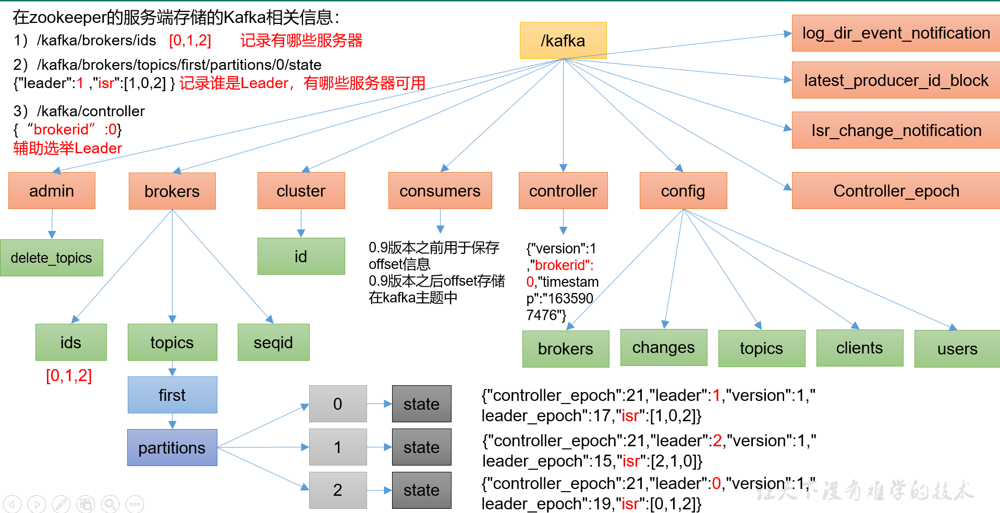


### 2.Kafka总体的工作流程

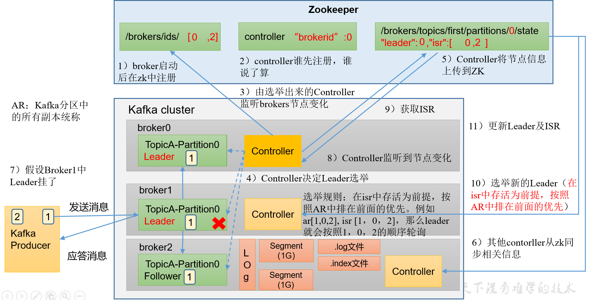

kafka broker流程分为：

1. broker启动后在zk注册
2. controller谁先注册，谁说了算
3. 由选举出来的Controller监听brokers节点变化
4. Controller决定Leader选举
5. Controller将节点信息上传到ZK
6. 其他Controller从zk同步相关信息
7. 假设Broker中Leader挂了
8. Controller监听到节点变化
9. 获取ISR
10. 选举新的Leader（<font color='red'>**在ISR中存活为前提，按照AR中在前面的优先**</font>）
11. 更新Leader及ISR


### 3.Broker 重要参数

| 参数名称                                | 描述                                                         |
| --------------------------------------- | :----------------------------------------------------------- |
| replica.lag.time.max.ms                 | ISR中，如果Follower长时间未向Leader发送通信请求或同步数据，则该Follower将被踢出ISR。该时间阈值，<font color='red'>**默认30s**</font>。 |
| auto.leader.rebalance.enable            | <font color='red'>**默认是true**</font>。  自动Leader  Partition 平衡。 |
| leader.imbalance.per.broker.percentage  | **默认是10%**。每个broker允许的不平衡的leader的比率。如果每个broker超过了这个值，控制器会触发leader的平衡。 |
| leader.imbalance.check.interval.seconds | **默认值300秒**。检查leader负载是否平衡的间隔时间。          |
| log.segment.bytes                       | Kafka中log日志是分成一块块存储的，此配置是指log日志划分 成块的大小，**默认值1G。** |
| log.index.interval.bytes                | **默认4kb**，kafka里面每当写入了4kb大小的日志（.log），然后就往index文件里面记录一个索引。 |
| log.retention.hours                     | Kafka中数据保存的时间，**默认7天**。                         |
| log.retention.minutes                   | Kafka中数据保存的时间，**分钟级别**，默认关闭。              |
| log.retention.ms                        | Kafka中数据保存的时间，**毫秒级别**，默认关闭。              |
| log.retention.check.interval.ms         | 检查数据是否保存超时的间隔，默认是5分钟。                    |
| log.retention.bytes                     | <font color='red'>**默认等于-1，表示无穷大**</font>。超过设置的所有日志总大小，删除最早的segment。 |
| log.cleanup.policy                      | 默认是delete，表示所有数据启用删除策略；  如果设置值为compact，表示所有数据启用压缩策略。 |
| num.io.threads                          | **默认是8**。负责写磁盘的线程数。整个参数值要占总核数的50%。 |
| num.replica.fetchers                    | **副本拉取线程数**，这个参数占总核数的50%的1/3               |
| num.network.threads                     | **默认是3**。数据传输线程数，这个参数占总核数的50%的2/3 。   |
| log.flush.interval.messages             | 强制页缓存刷写到磁盘的条数，默认是long的最大值，9223372036854775807。一般不建议修改，交给系统自己管理。 |
| log.flush.interval.ms                   | 每隔多久，刷数据到磁盘，默认是null。一般不建议修改，交给系统自己管理。 |


## 二、节点服役和退役


### 1.服役新节点

> 场景：当新加入一个broker节点时

**执行负载均衡操作**

1. 创建一个要均衡的主题。

```shell
[atguigu@hadoop102 kafka]$ vim topics-to-move.json 

{
    "topics": [

        {"topic": "first"}

    ],

    "version": 1
}
```

2. 生成一个负载均衡的计划

```shell
[atguigu@hadoop102 kafka]$ bin/kafka-reassign-partitions.sh --bootstrap-server hadoop102:9092  --topics-to-move-json-file topics-to-move.json --broker-list "0,1,2,3" --generate

Current partition replica assignment
{"version":1,"partitions":[{"topic":"first","partition":0,"replicas":[0,2,1],"log_dirs":["any","any","any"]},{"topic":"first","partition":1,"replicas":[2,1,0],"log_dirs":["any","any","any"]},{"topic":"first","partition":2,"replicas":[1,0,2],"log_dirs":["any","any","any"]}]}

Proposed partition reassignment configuration
{"version":1,"partitions":[{"topic":"first","partition":0,"replicas":[2,3,0],"log_dirs":["any","any","any"]},{"topic":"first","partition":1,"replicas":[3,0,1],"log_dirs":["any","any","any"]},{"topic":"first","partition":2,"replicas":[0,1,2],"log_dirs":["any","any","any"]}]}
```

3. 创建副本存储计划（所有副本存储在broker0、broker1、broker2、broker3）

```shell
[atguigu@hadoop102 kafka]$ vim increase-replication-factor.json
```

输入如下内容：

```shell
{"version":1,"partitions":[{"topic":"first","partition":0,"replicas":[2,3,0],"log_dirs":["any","any","any"]},{"topic":"first","partition":1,"replicas":[3,0,1],"log_dirs":["any","any","any"]},{"topic":"first","partition":2,"replicas":[0,1,2],"log_dirs":["any","any","any"]}]}
```

4. 执 行副本存储计划。

```
[atguigu@hadoop102 kafka]$ bin/kafka-reassign-partitions.sh --bootstrap-server hadoop102:9092 --reassignment-json-file increase-replication-factor.json --execute
```

5. 验证副本存储计划。

```shell
[atguigu@hadoop102 kafka]$ bin/kafka-reassign-partitions.sh --bootstrap-server hadoop102:9092 --reassignment-json-file increase-replication-factor.json --verify

Status of partition reassignment:

Reassignment of partition first-0 is complete.

Reassignment of partition first-1 is complete.

Reassignment of partition first-2 is complete.

Clearing broker-level throttles on brokers 0,1,2,3

Clearing topic-level throttles on topic first
```


### 2.退役旧节点

**1**）执行负载均衡操作

先按照退役一台节点，生成执行计划，然后按照服役时操作流程执行负载均衡。

​    （1）创建一个要均衡的主题。

```shell
[atguigu@hadoop102 kafka]$ vim topics-to-move.json 
{
  "topics": [
​    {"topic": "first"}
  ],
  "version": 1
}
```

​    （2）创建执行计划。

```shell
[atguigu@hadoop102 kafka]$ bin/kafka-reassign-partitions.sh --bootstrap-server hadoop102:9092 --topics-to-move-json-file topics-to-move.json --broker-list "0,1,2" --generate
Current partition replica assignment
{"version":1,"partitions":[{"topic":"first","partition":0,"replicas":[2,0,1],"log_dirs":["any","any","any"]},{"topic":"first","partition":1,"replicas":[3,1,2],"log_dirs":["any","any","any"]},{"topic":"first","partition":2,"replicas":[0,2,3],"log_dirs":["any","any","any"]}]}
Proposed partition reassignment configuration
{"version":1,"partitions":[{"topic":"first","partition":0,"replicas":[2,0,1],"log_dirs":["any","any","any"]},{"topic":"first","partition":1,"replicas":[0,1,2],"log_dirs":["any","any","any"]},{"topic":"first","partition":2,"replicas":[1,2,0],"log_dirs":["any","any","any"]}]}
```

（3）创建副本存储计划（所有副本存储在broker0、broker1、broker2中）。

```shell
[atguigu@hadoop102 kafka]$ vim increase-replication-factor.json

{"version":1,"partitions":[{"topic":"first","partition":0,"replicas":[2,0,1],"log_dirs":["any","any","any"]},{"topic":"first","partition":1,"replicas":[0,1,2],"log_dirs":["any","any","any"]},{"topic":"first","partition":2,"replicas":[1,2,0],"log_dirs":["any","any","any"]}]}
```

（4）执行副本存储计划。

```shell
[atguigu@hadoop102 kafka]$ bin/kafka-reassign-partitions.sh --bootstrap-server hadoop102:9092 --reassignment-json-file increase-replication-factor.json --execute
```

（5）验证副本存储计划。

```shell
[atguigu@hadoop102 kafka]$ bin/kafka-reassign-partitions.sh --bootstrap-server hadoop102:9092 --reassignment-json-file increase-replication-factor.json --verify
Status of partition reassignment:
Reassignment of partition first-0 is complete.
Reassignment of partition first-1 is complete.
Reassignment of partition first-2 is complete.
Clearing broker-level throttles on brokers 0,1,2,3
Clearing topic-level throttles on topic first
```

**2**）执行停止命令

​    在hadoop105上执行停止命令即可。

```
[atguigu@hadoop105 kafka]$ bin/kafka-server-stop.sh 
```


## 三、Kafka副本


### 1.副本基本信息

1. Kafka副本作用：提高数据可靠性
2. Kafka默认副本1个，生产环境一般配置为2个，保证数据可靠性；太多副本会增加磁盘存储空间，增加网络上数据传输，降低效率。
3. Kafka中副本分为：**Leader 和 Follower**。Kafka生产者只会把数据发往Leader，然后Follower找Leader进行同步数据。
4. Kafka分区中所有副本统称为AR

​	<font color='red'>**AR=ISR+OSR**</font>

<font color='green'>**ISR**</font>:     表示和Leader保持同步的Follower集合。如果Follower长时间未向Leader发送通信请求或同步数据，则该Follower将被踢出ISR。该时间阈值由**replica.lag.time.max.ms**参数设定，默认30s。Leader发生故障之后，就会从ISR中选举新的Leader。

<font color='green'>**OSR**</font>:  表示Follower与Leader副本同步时，延迟过多的副本。


### 2.Leader选举流程

Kafka集群中有一个broker的Controller会被选举为Controller Leader，	<font color='red'>**负责管理集群broker的上下线**</font>，所有topic的	<font color='red'>**分区副本分配和Leader选举**</font>等工作。

**Controller的信息同步工作是依赖于Zookeeper的。**

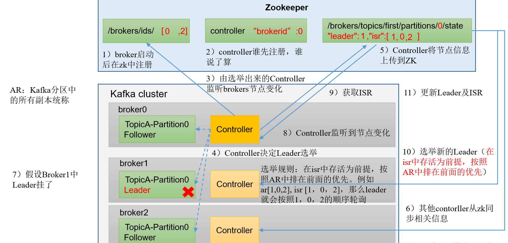

### 3.Leader和Follower故障处理细节

> <font color='red'>**LEO**</font> : 每个副本的最后一个offset，LEO其实就是最新的offset+1。
>
> <font color='red'>**HW**</font> :所有副本的最小LEO。

<font color='red'>Follower</font>故障解决方法：

1. Follower发生故障后会被临时踢出ISR
2. 这个期间Leader和Follower继续接受数据
3. 待该Follower恢复后，Follower会读取本地磁盘记录的上次的HW，并将log文件高于HW的部分截取掉，从HW开始向Leader进行同步。
4. 等该<font color='red'>**Follower的LEO大于等于该Partition的HW**</font>，即Follower追上Leader之后，就可以<font color='red'>**重新加入ISR了**</font>。

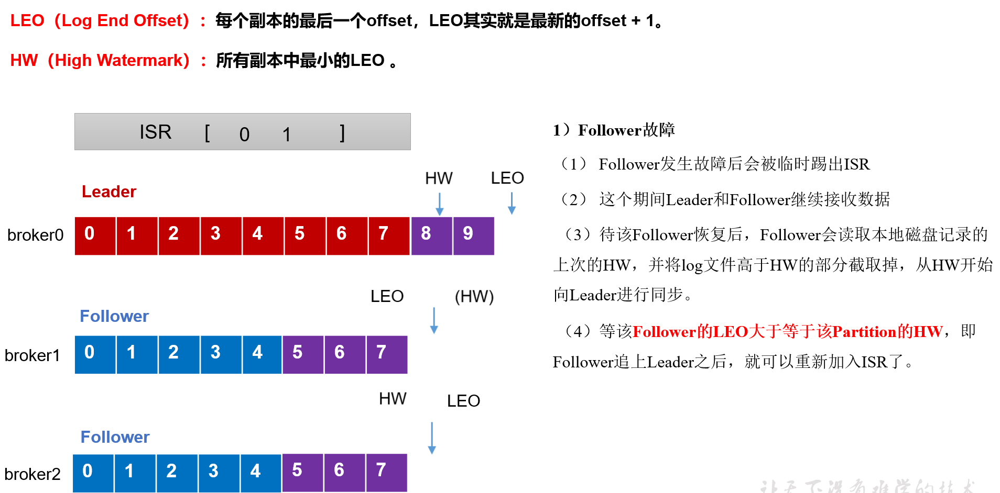


<font color='red'>**Leader**</font>故障解决方法：

1. Leader发生故障之后，会从ISR中选出一个新的Leader
2. 为保证多个副本之间的数据一致性，其余的Follower会先将各自的log文件高于HW的部分截掉，然后从新的Leader同步数据

<font color='red'>**注意：这只能保证副本之间的数据一致性，并不能保证数据不丢失或者不重复。**</font>


### 4.分区副本分配

>  如果kafka服务器只有4个节点，那么设置kafka的分区数大于服务器台数，在kafka底层如何分配存储副本呢？

1. 创建16分区，3个副本
   1. 创建一个新的topic，名称 为 second。

```shell
[atguigu@hadoop102 kafka]$ bin/kafka-topics.sh --bootstrap-server hadoop102:9092 --create --partitions 16 --replication-factor 3 --topic second
```

2. 查看分区和副本情况。

   ```shell
   [atguigu@hadoop102 kafka]$ bin/kafka-topics.sh --bootstrap-server hadoop102:9092 --describe --topic second
   
   Topic: second4	Partition: 0	Leader: 0	Replicas: 0,1,2	Isr: 0,1,2
   Topic: second4	Partition: 1	Leader: 1	Replicas: 1,2,3	Isr: 1,2,3
   Topic: second4	Partition: 2	Leader: 2	Replicas: 2,3,0	Isr: 2,3,0
   Topic: second4	Partition: 3	Leader: 3	Replicas: 3,0,1	Isr: 3,0,1
   
   Topic: second4	Partition: 4	Leader: 0	Replicas: 0,2,3	Isr: 0,2,3
   Topic: second4	Partition: 5	Leader: 1	Replicas: 1,3,0	Isr: 1,3,0
   Topic: second4	Partition: 6	Leader: 2	Replicas: 2,0,1	Isr: 2,0,1
   Topic: second4	Partition: 7	Leader: 3	Replicas: 3,1,2	Isr: 3,1,2
   
   Topic: second4	Partition: 8	Leader: 0	Replicas: 0,3,1	Isr: 0,3,1
   Topic: second4	Partition: 9	Leader: 1	Replicas: 1,0,2	Isr: 1,0,2
   Topic: second4	Partition: 10	Leader: 2	Replicas: 2,1,3	Isr: 2,1,3
   Topic: second4	Partition: 11	Leader: 3	Replicas: 3,2,0	Isr: 3,2,0
   
   Topic: second4	Partition: 12	Leader: 0	Replicas: 0,1,2	Isr: 0,1,2
   Topic: second4	Partition: 13	Leader: 1	Replicas: 1,2,3	Isr: 1,2,3
   Topic: second4	Partition: 14	Leader: 2	Replicas: 2,3,0	Isr: 2,3,0
   Topic: second4	Partition: 15	Leader: 3	Replicas: 3,0,1	Isr: 3,0,1
   ```


### 5.手动调整分区副本存储

> 在生产环境中，每台服务器的配置和性能不一致，但是Kafka只会根据自己的代码规则创建对应的分区副本，就会导致个别服务器存储压力较大。所以需要手动调整分区副本的存储。

需求：<font color='red'>**创建一个新的topic，4个分区，两个副本，名称为three，将该topic的所有副本都存储到broker0和broker1两台服务器上。**</font>

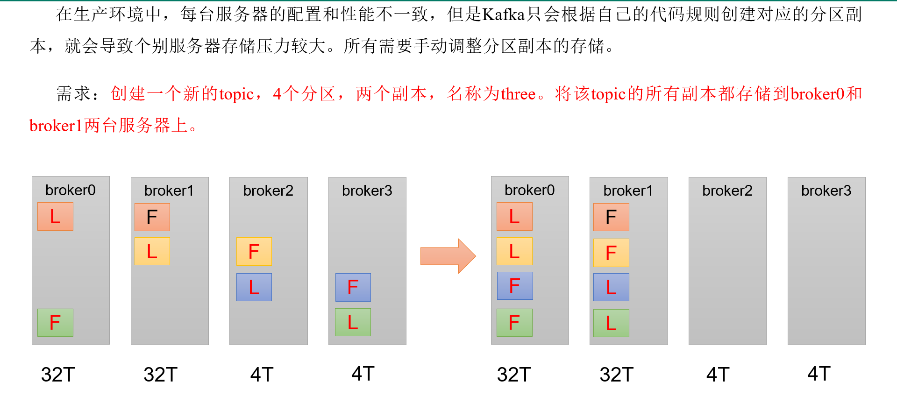

手动调整分区副本存储的步骤如下：

1. 创建一个新的topic，名称为three。

```shell
[atguigu@hadoop102 kafka]$ bin/kafka-topics.sh --bootstrap-server hadoop102:9092 --create --partitions 4 --replication-factor 2 --topic three
```

2. 查看分区副本存储情况。

```shell
[atguigu@hadoop102 kafka]$ bin/kafka-topics.sh --bootstrap-server hadoop102:9092 --describe --topic three
```

3. 创建副本存储计划（所有副本都指定存储在broker0、broker1中）。

```shell
[atguigu@hadoop102 kafka]$ vim increase-replication-factor.json
```

输入如下内容：

```
{
  "version":1,
 "partitions":[{"topic":"three","partition":0,"replicas":[0,1]},
      {"topic":"three","partition":1,"replicas":[0,1]},
      {"topic":"three","partition":2,"replicas":[1,0]},
      {"topic":"three","partition":3,"replicas":[1,0]}]
}
```

4. 执行副本存储计划。

```
[atguigu@hadoop102 kafka]$ bin/kafka-reassign-partitions.sh --bootstrap-server hadoop102:9092 --reassignment-json-file increase-replication-factor.json --execute
```

5. 验证副本存储计划。

```
[atguigu@hadoop102 kafka]$ bin/kafka-reassign-partitions.sh --bootstrap-server hadoop102:9092 --reassignment-json-file increase-replication-factor.json --verify
```

6. 查看分区副本存储情况。

```
[atguigu@hadoop102 kafka]$ bin/kafka-topics.sh --bootstrap-server hadoop102:9092 --describe --topic three
```

### 6.Partition自动平衡

> 正常情况下，Kafka<font color='red'>**本身会自动把Leader Partition均匀分散到各个机器上**</font>，来保证每台机器的读写吞吐量但是均匀的。但是如果<font color='red'>**某些broker宕机，会导致Leader Partiton过于集中在其他少部分几台broker上**</font>，这会导致少数几台broker的读写请求压力过高，其他宕机的broker重启之后都是follower partition，读写请求很低，<font color='red'>**造成集群负载不均衡**</font>。

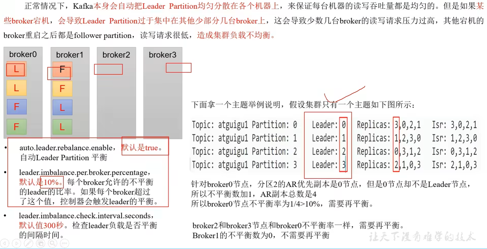


| 参数名称                                | 描述                                                         |
| --------------------------------------- | ------------------------------------------------------------ |
| auto.leader.rebalance.enable            | 默认是true。 自动Leader Partition 平衡。生产环境中，leader重选举的代价比较大，可能会带来性能影响，建议设置为false关闭。 |
| leader.imbalance.per.broker.percentage  | 默认是10%。每个broker允许的不平衡的leader的比率。如果每个broker超过了这个值，控制器会触发leader的平衡。 |
| leader.imbalance.check.interval.seconds | 默认值300秒。检查leader负载是否平衡的间隔时间。              |


### 7.增加副本因子

> 在生产环境当中，由于某个主题的重要等级需要提升，我们考虑增加副本。副本数的增加需要先制定计划，然后根据计划执行。

1. 创建 topic

```shell
[atguigu@hadoop102 kafka]$ bin/kafka-topics.sh --bootstrap-server hadoop102:9092 --create --partitions 3 --replication-factor 1 --topic four
```

2. 手动增加副本存储
   1. 创建副本存储计划（所有副本都指定存储在broker0、broker1、broker2中）。

```shell
[atguigu@hadoop102 kafka]$ vim increase-replication-factor.json
#输入以下内容
{"version":1,"partitions":[{"topic":"four","partition":0,"replicas":[0,1,2]},{"topic":"four","partition":1,"replicas":[0,1,2]},{"topic":"four","partition":2,"replicas":[0,1,2]}]}
```

​            2.执行副本存储计划

```shell
[atguigu@hadoop102 kafka]$ bin/kafka-reassign-partitions.sh --bootstrap-server hadoop102:9092 --reassignment-json-file increase-replication-factor.json --execute
```


## 四、文件存储

### 1.文件存储机制

Topic是逻辑上的概念，而partition是物理上的概念，<font color='red'>**每个partition对应于一个log文件**</font>，该log文件中存储的就是Producer生产的数据。<font color='red'>**Producer生产的数据会被不断追加到该log文件末端**</font>，为防止log文件过大导致数据定位效率低下，Kafka采取了<font color='red'>**分片**</font>和<font color='red'>**索引**</font>机制，将<font color='red'>**每个Partition分为多个segment。每个segment包括**</font>：“.index”文件、“.log”文件和.timeindex等文件。这些文件位于一个文件夹下，该文件夹的命名规则为： topic名称+分区序号，例如：**first-0**.

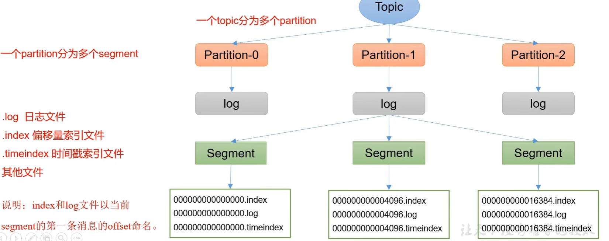

#### Log文件和index文件详解

> 注意： <font color='red'>**1.index为稀疏索引，大约每往log文件写入4kb数据，会往index文件写入一条索引。参数log.index.interval.bytes默认4kb**</font>
>
> <font color='red'>**2.index文件中保存的offset为相对offset，这样能确保offset的值所占空间不会过大，因此能将offset的值控制在固定大小。**</font>

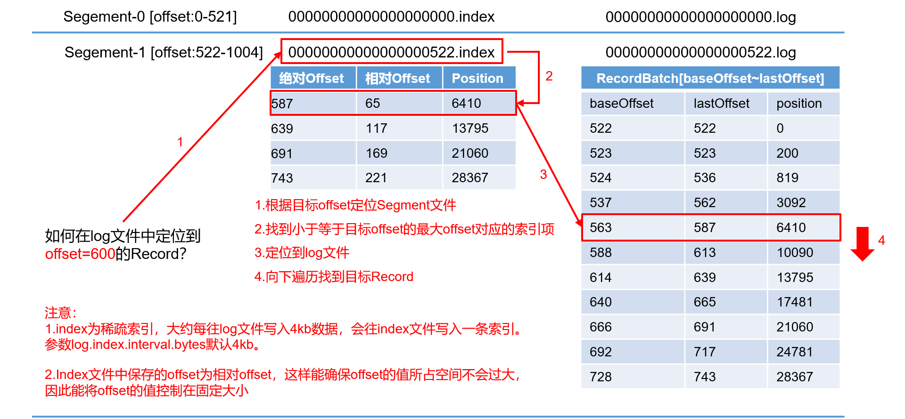


### 2.Kafka文件清除策略

​	Kafka中<font color='red'>**默认的日志保存时间为7天**</font>，可以通过调整如下参数修改保存时间。

- log.retention.hours，最低优先级小时，默认7天。
-  log.retention.minutes，分钟。
- log.retention.ms，最高优先级毫秒。
- log.retention.check.interval.ms，负责设置检查周期，默认5分钟。

​	那么日志一旦超过了设置的时间，怎么处理呢？

​	Kafka中提供的日志清理策略有<font color='red'>**delete**</font>和<font color='red'>**compact**</font>两种。

1）<font color='red'>**delete日志删除**</font>：将过期数据删除

- log.cleanup.policy = delete  所有数据启用删除策略

（1）<font color='red'>**基于时间：默认打开。以segment中所有记录中的最大时间戳作为该文件时间戳**</font>。

（2）<font color='red'>**基于大小：默认关闭**</font>。超过设置的所有日志总大小，删除最早的segment。

​	log.retention.bytes，默认等于-1，表示无穷大。

**思考：**如果一个segment中有一部分数据过期，一部分没有过期，怎么处理？

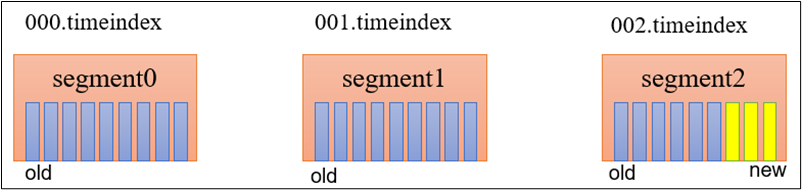

2）<font color='red'>**compact日志压缩**</font>

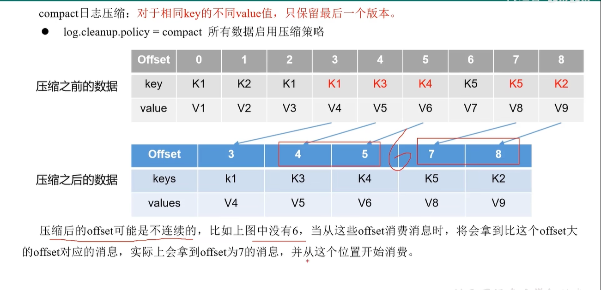

<font color='red'>这种策略只适合特殊场景，比如消息的key是用户ID，value是用户的资料，通过这种压缩策略，整个消息集就保存了所有用户最新的资料。</font>


## 五、高效读写数据

**1**）**Kafka本身是分布式集群，可以采用分区技术，并行度高**

**2）读数据采用稀疏索引，可以快速定位要消费的数据**

**3）顺序写磁盘**

​		Kafka的producer生产数据，要写入到log文件中，写的过程是<font color='red'>**一直追加到**</font>文件末端，为顺序写。**官网有数据表明**，同样的磁盘，顺序写能到600M/s，而随机写只有100K/s。这与磁盘的机械机构有关，顺序写之所以快，是因为其省去了大量磁头寻址的时间。

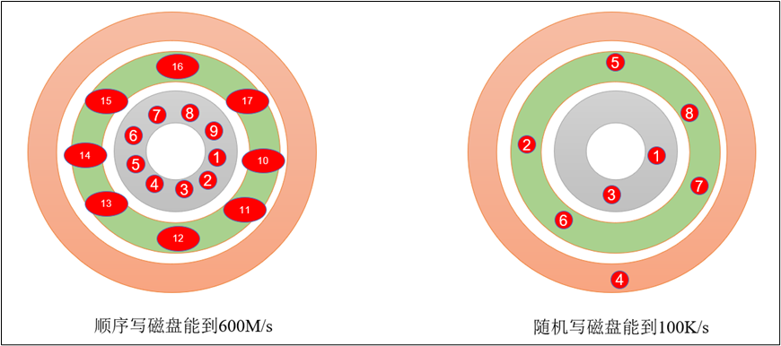

**4**）**页缓存** + **零拷贝技术**

​	零拷贝：Kafka的数据加工处理操作交由Kafka生产者和Kafka消费者处理。<font color='red'>**Kafka Broker应用层不关心存储的数据，所以就不用走应用层，传输效率高**</font>

​	页缓存pageCache：Kafka重度依赖底层操作系统提供的PageCache功能。当上层有写操作时，操作系统只是将数据写入PageCache。当读操作发生时，先从PageCahce重查找，如果找不到，再去磁盘中读取。<font color='red'>**实际上PageCache是把尽可能多的空闲内存都当做了磁盘缓存来使用**</font>（类似MySQL的buffpool）。

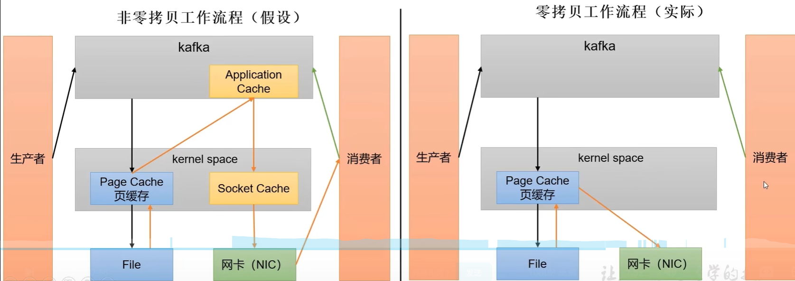

| 参数                        | 描述                                                         |
| --------------------------- | ------------------------------------------------------------ |
| log.flush.interval.messages | 强制页缓存刷写到磁盘的条数，默认是long的最大值，9223372036854775807。一般不建议修改，交给系统自己管理。 |
| log.flush.interval.ms       | 每隔多久，刷数据到磁盘，默认是null。一般不建议修改，交给系统自己管理。 |
