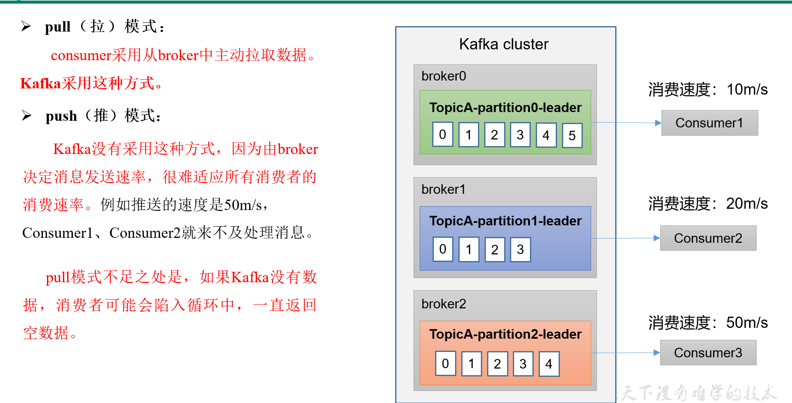
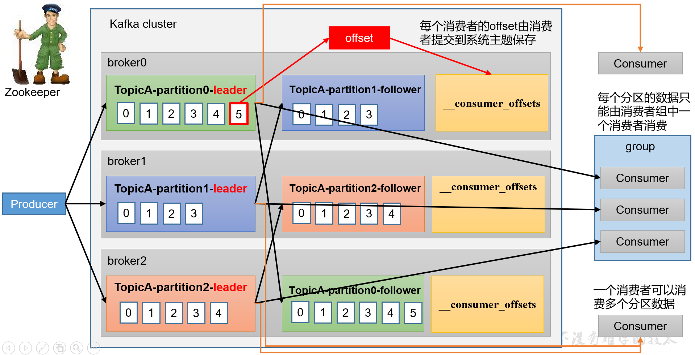
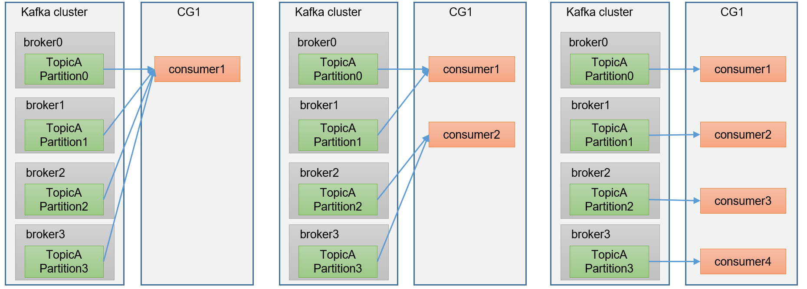
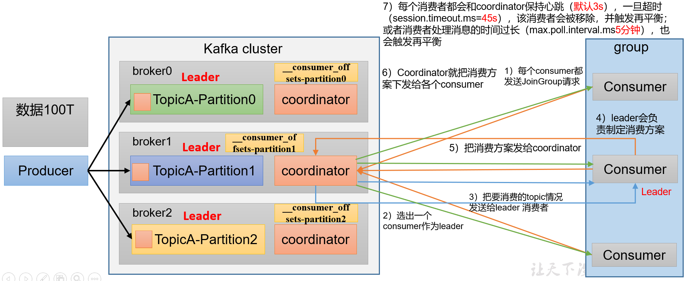
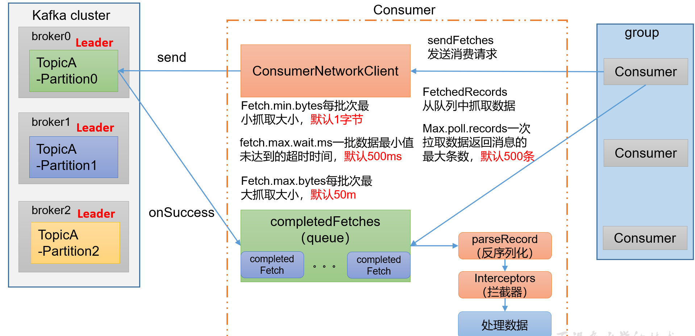
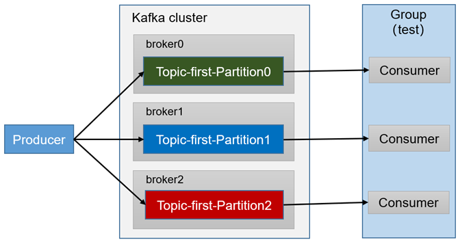
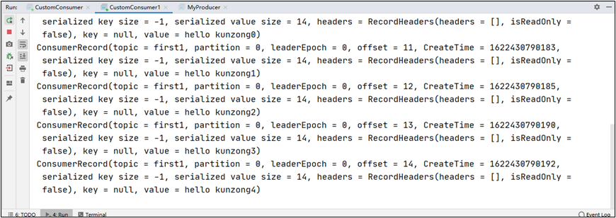
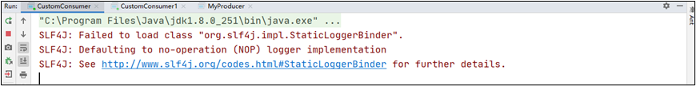

> kafka 消费者

## 一、消费方式

1. pull（<font color='red'>**拉**</font>模式）
   1. consumer采用从broker中主动拉取数据。Kafka采用这种方式
2. push(<font color='red'>**推**</font>模式)
   1. Kafka没有采用这种方式，因为由broker决定消息发送速率，很难适应所以消费者的消费速率。例如推送的速度是50m/s，consumer1、consumer2就来不及处理消息。
   2. <font color='red'>**pull模式不足之处是，如果Kafka没有数据，消费者可能会陷入循环中，一直返回空数据。**</font>



- 一个消费者可以消费多个分区数据
- **每个分区的数据**<font color='red'>**只能由消费者组中一个消费者消费**</font>
- 每个消费者的offset由消费者提交到系统主题保存（<font color='red'>**确认消费者消费到哪里了**</font>）


## 二、Kafka消费者工作流程

### 1.消费者总体工作流程




### 2.消费者组原理

Consumer Group（CG）：消费者组，由多个consumer组成，形成一个消费者组的条件，是所有消费者的gruopid相同。

- <font color='red'>**消费者组内每个消费者负责消费不同分区的数据，一个分区只能由一个组内消费者消费**</font>
- <font color='red'>**消费者组之间互不影响**</font>。所有的消费者都属于某个消费者组，即消费者组是逻辑上的一个订阅者




### 3.消费者重要参数

coordinator：**辅助实现消费者组的初始化** 和 **分区的分配**

coordinator节点选择 =<font color='red'>**groupid的hashcode值 % 50（_consumer_offset的分区数量**</font>>





### 4.消费者组详细消费流程

consumer中有一个<font color='red'>**ConsumerNetworkClient**</font>用来fetch信息

- fetch.min.bytes每批次最小抓取大小，默认<font color='red'>**1字节**</font>
- fetch.min.wait.ms一批数据最小值未达到的超时时间，<font color='red'>**默认问500ms**</font>
- fetch.max.bytes每批次最大抓取最小，<font color='red'>**默认50m**</font>

**拦截器：处理数据**



| 参数名称                             | 描述                                                         |
| ------------------------------------ | ------------------------------------------------------------ |
| bootstrap.servers                    | 向Kafka集群建立初始连接用到的host/port列表。                 |
| key.deserializer和value.deserializer | 指定接收消息的key和value的反序列化类型。一定要写全类名。     |
| group.id                             | 标记消费者所属的消费者组。                                   |
| enable.auto.commit                   | 默认值为true，消费者会自动周期性地向服务器提交偏移量。       |
| auto.commit.interval.ms              | 如果设置了  enable.auto.commit 的值为true， 则该值定义了消费者偏移量向Kafka提交的频率，默认5s。 |
| auto.offset.reset                    | 当Kafka中没有初始偏移量或当前偏移量在服务器中不存在（如，数据被删除了），该如何处理？ earliest：自动重置偏移量到最早的偏移量。  latest：默认，自动重置偏移量为最新的偏移量。 none：如果消费组原来的（previous）偏移量不存在，则向消费者抛异常。 anything：向消费者抛异常。 |
| offsets.topic.num.partitions         | __consumer_offsets的分区数，默认是50个分区。                 |
| heartbeat.interval.ms                | Kafka消费者和coordinator之间的心跳时间，默认3s。  该条目的值必须小于  session.timeout.ms ，也不应该高于 session.timeout.ms 的1/3。 |
| session.timeout.ms                   | Kafka消费者和coordinator之间连接超时时间，默认45s。超过该值，该消费者被移除，消费者组执行再平衡。 |
| max.poll.interval.ms                 | 消费者处理消息的最大时长，默认是5分钟。超过该值，该消费者被移除，消费者组执行再平衡。 |
| fetch.min.bytes                      | 默认1个字节。消费者获取服务器端一批消息最小的字节数。        |
| fetch.max.wait.ms                    | 默认500ms。如果没有从服务器端获取到一批数据的最小字节数。该时间到，仍然会返回数据。 |
| fetch.max.bytes                      | 默认Default: 52428800（50 m）。消费者获取服务器端一批消息最大的字节数。如果服务器端一批次的数据大于该值（50m）仍然可以拉取回来这批数据，因此，这不是一个绝对最大值。一批次的大小受message.max.bytes （broker config）or max.message.bytes （topic config）影响。 |
| max.poll.records                     | 一次poll拉取数据返回消息的最大条数，默认是500条。            |

## 三、消费者API

1. 需求：测试同一个主题的分区数据，只能由一个消费者组中的一个消费。 



2. 实例实操
   1. 复制一份基础消费者的代码，在IDEA中同时启动，即可启动同一个消费者组中的两个消费者。

```java
package com.atguigu.kafka.consumer;

import org.apache.kafka.clients.consumer.ConsumerConfig;
import org.apache.kafka.clients.consumer.ConsumerRecord;
import org.apache.kafka.clients.consumer.ConsumerRecords;
import org.apache.kafka.clients.consumer.KafkaConsumer;

import java.time.Duration;
import java.util.ArrayList;
import java.util.Properties;

public class CustomConsumer1 {

    public static void main(String[] args) {

        // 1.创建消费者的配置对象
        Properties properties = new Properties();

        // 2.给消费者配置对象添加参数
        properties.put(ConsumerConfig.BOOTSTRAP_SERVERS_CONFIG, "hadoop102:9092");

        // 配置序列化 必须
        properties.put(ConsumerConfig.KEY_DESERIALIZER_CLASS_CONFIG, StringDeserializer.class.getName());
        properties.put(ConsumerConfig.VALUE_DESERIALIZER_CLASS_CONFIG, StringDeserializer.class.getName());

        // 配置消费者组 必须
        properties.put(ConsumerConfig.GROUP_ID_CONFIG, "test");

        // 创建消费者对象
        KafkaConsumer<String, String> kafkaConsumer = new KafkaConsumer<String, String>(properties);

        // 注册主题
        ArrayList<String> topics = new ArrayList<>();
        topics.add("first");
        kafkaConsumer.subscribe(topics);

        // 拉取数据打印
        while (true) {
            // 设置1s中消费一批数据
            ConsumerRecords<String, String> consumerRecords = kafkaConsumer.poll(Duration.ofSeconds(1));

            // 打印消费到的数据
            for (ConsumerRecord<String, String> consumerRecord : consumerRecords) {
                System.out.println(consumerRecord);
            }
        }
    }
}

```

​		2. 启动代码中的生产者发送消息，在IDEA控制台即可看到两个消费者在消费不同分区的数据（如果只发生到一个分区，可以在发送时增加延迟代码Thread.sleep(2);）。

```
ConsumerRecord(topic = first, partition = 0, leaderEpoch = 2, offset = 3, CreateTime = 1629169606820, serialized key size = -1, serialized value size = 8, headers = RecordHeaders(headers = [], isReadOnly = false), key = null, value = hello1)

ConsumerRecord(topic = first, partition = 1, leaderEpoch = 3, offset = 2, CreateTime = 1629169609524, serialized key size = -1, serialized value size = 6, headers = RecordHeaders(headers = [], isReadOnly = false), key = null, value = hello2)

ConsumerRecord(topic = first, partition = 2, leaderEpoch = 3, offset = 21, CreateTime = 1629169611884, serialized key size = -1, serialized value size = 6, headers = RecordHeaders(headers = [], isReadOnly = false), key = null, value = hello3)
```

​		3.重新发送到一个全新的主题中，由于默认创建的主题分区数为1，可以看到只能有一个消费者消费到数据。






## 四、分区的分配以及再平衡

> 一个consumer group 中有多个consumer组成，一个topic有多个partition组成，现在的问题是，<font color='red'>**到底由哪个consumer来消费哪个partition的数据。**</font>

Kafka有四种主流的分区分配策略：<font color='red'>**Range、RoundRobin、Sticky、CooperativeSticky。**</font>

可以通过配置参数 <font color='red'>**partition.assignment.strategy**</font>,修改分区的分配策略。默认策略是 <font color='red'>**Range+CooperativeSticky**</font>

| 参数名称                      | 描述                                                         |
| ----------------------------- | ------------------------------------------------------------ |
| heartbeat.interval.ms         | Kafka消费者和coordinator之间的心跳时间，**默认3s**。  该条目的值必须小于 session.timeout.ms，也不应该高于 session.timeout.ms 的1/3。 |
| session.timeout.ms            | Kafka消费者和coordinator之间连接超时时间**，默认45s**。超过该值，该消费者被移除，消费者组执行再平衡。 |
| max.poll.interval.ms          | 消费者处理消息的最大时长，**默认是5分钟**。超过该值，该消费者被移除，消费者组执行再平衡。 |
| partition.assignment.strategy | 消费者分区分配策略，默认策略是Range + CooperativeSticky。Kafka可以同时使用多个分区分配策略。可以选择的策略包括：Range、RoundRobin、Sticky、CooperativeSticky |