> kafka 生产者


## 一、生产者消息发送流程

### 1.发送原理

1. Kafka Producer 生产者

1. 1. Interceptors 拦截器

2. Serializer 序列号器

3. Partitioner 分区器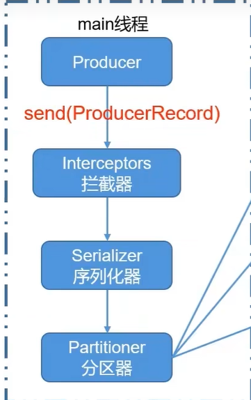

4. 分区器（默认大小32M）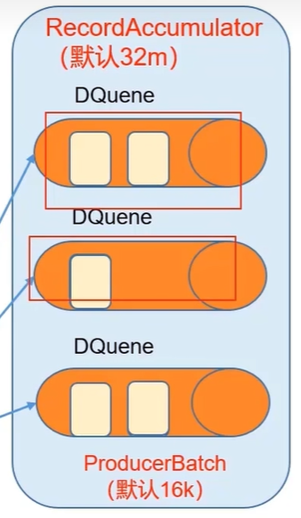

5. sender线程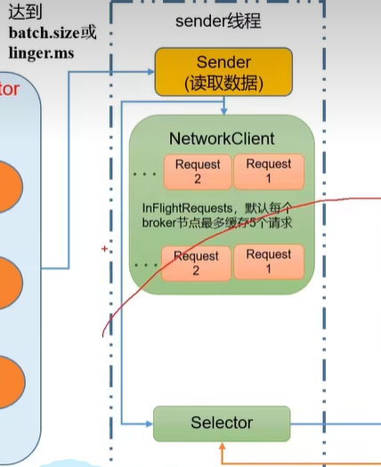

    1. batch.size: 只有数据积累到batch.size,sender才会发送数据。默认16k。
    2. linger.ms: 如果数据迟迟未达到batch.size，sender等待linger.ms设置的时间到了之后就会发送数据。单位ms，默认值是0ms，表示没有延迟。

6. Kafka集群

    1. 应答acks：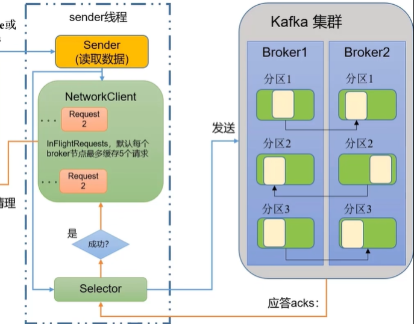

       <font color='red'>**0**</font>：生产者发送过来的数据，不需要等待数据落盘应答

       <font color='red'>**1**</font>：生产者发送过来的数据，Leader收到数据后应答。

       <font color='red'>**-1（all）**</font>:生产者发送过来的数据，Leader和ISR队列里面的所有节点收齐数据后应答，-1和all等价。

### 2.异步发送API

#### 普通的发送方法

```java
public class CustomProducer {
    public static void main(String[] args) {

        // 0. 配置

        Properties properties = new Properties();
        //连接集群
        properties.put(ProducerConfig.BOOTSTRAP_SERVERS_CONFIG, "localhost:9092");

        // key,value序列化（必须）：key.serializer，value.serializer
        properties.put(ProducerConfig.KEY_SERIALIZER_CLASS_CONFIG, StringSerializer.class.getName());
        properties.put(ProducerConfig.VALUE_SERIALIZER_CLASS_CONFIG, StringSerializer.class.getName());
        // 1. 创建kafka生产者对象
        KafkaProducer<String,String> kafkaProducer = new KafkaProducer<String, String>(properties);
        // 2. 发送数据
        for (int i = 0; i < 5; i++) {
            kafkaProducer.send(new ProducerRecord<>("first","lyj"+i));
        }
        // 3.关闭资源
        kafkaProducer.close();
    }
}

```

#### 带回调函数的发送方法

```java
public class CustomProducer {
    public static void main(String[] args) {

        // 0. 配置

        Properties properties = new Properties();
        //连接集群
        properties.put(ProducerConfig.BOOTSTRAP_SERVERS_CONFIG, "localhost:9092");

        // key,value序列化（必须）：key.serializer，value.serializer
        properties.put(ProducerConfig.KEY_SERIALIZER_CLASS_CONFIG, StringSerializer.class.getName());
        properties.put(ProducerConfig.VALUE_SERIALIZER_CLASS_CONFIG, StringSerializer.class.getName());
        // 1. 创建kafka生产者对象
        KafkaProducer<String,String> kafkaProducer = new KafkaProducer<String, String>(properties);
        // 2. 发送数据
        for (int i = 0; i < 5; i++) {
            kafkaProducer.send(new ProducerRecord<>("first", "lyj" + i), new Callback() {
                @Override
                public void onCompletion(RecordMetadata recordMetadata, Exception e) {
                    if (e==null){
                        System.out.println("主题"+recordMetadata.topic()+" 分区"+recordMetadata.partition());
                    }
                }
            });
        }
        // 3.关闭资源
        kafkaProducer.close();
    }
}

```

#### 同步发送

```java
public class CustomProducer {
    public static void main(String[] args) throws ExecutionException, InterruptedException {

        // 0. 配置

        Properties properties = new Properties();
        //连接集群
        properties.put(ProducerConfig.BOOTSTRAP_SERVERS_CONFIG, "localhost:9092");

        // key,value序列化（必须）：key.serializer，value.serializer
        properties.put(ProducerConfig.KEY_SERIALIZER_CLASS_CONFIG, StringSerializer.class.getName());
        properties.put(ProducerConfig.VALUE_SERIALIZER_CLASS_CONFIG, StringSerializer.class.getName());
        // 1. 创建kafka生产者对象
        KafkaProducer<String,String> kafkaProducer = new KafkaProducer<String, String>(properties);
        // 2. 发送数据
        for (int i = 0; i < 5; i++) {
            kafkaProducer.send(new ProducerRecord<>("first", "lyj" + i)).get();
        }
        // 3.关闭资源
        kafkaProducer.close();
    }
}
```

## 二、分区

1. <font color='red'>**便于合理使用存储资源**</font>，每个Partiton在一个Broker上存储，可以把海量的数据按照分区切割成一快一块数据存储在多台Broker上。合理控制分区的任务，可以实现<font color='red'>**负载均衡**</font>的效果 n。
2. <font color='red'>**提供并行度**</font>，生产者可以以分区为单位<font color='red'>**发送数据**</font>，消费者可以以分区为单位进行<font color='red'>**消费数据**</font>。

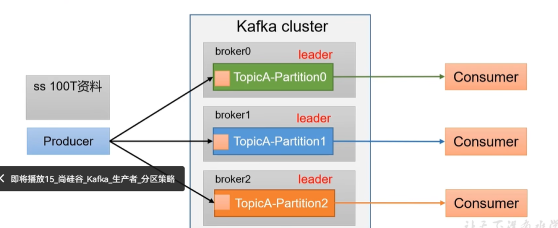

### 1.自定义分区器

```java
public class MyPartitoner implements Partitioner {
    @Override
    public int partition(String topic, Object key, byte[] bytes, Object value, byte[] bytes1, Cluster cluster) {
        // 获取数据 atguigu hello
        String msgValues = value.toString();
        int partition;

        if(msgValues.contains("atguigu")){
            partition=0;
        }else {
            partition=1;
        }
        return partition;
    }

    @Override
    public void close() {

    }

    @Override
    public void configure(Map<String, ?> map) {

    }
}
```

### 2.手动分区器

```java
        for (int i = 0; i < 5; i++) {
            kafkaProducer.send(new ProducerRecord<>("first",0,"0", "lyj" + i), new Callback() {
                @Override
                public void onCompletion(RecordMetadata recordMetadata, Exception e) {
                    if (e==null){
                        System.out.println("主题"+recordMetadata.topic()+" 分区"+recordMetadata.partition());
                    }
                }
            });
        }
```

## 三、生产者如何提供吞吐量

1. **batch.size 和 linger.ms 的大小配合**
2. **compression.type 压缩算法**
3. **RecordAccumulator 缓冲区大小**

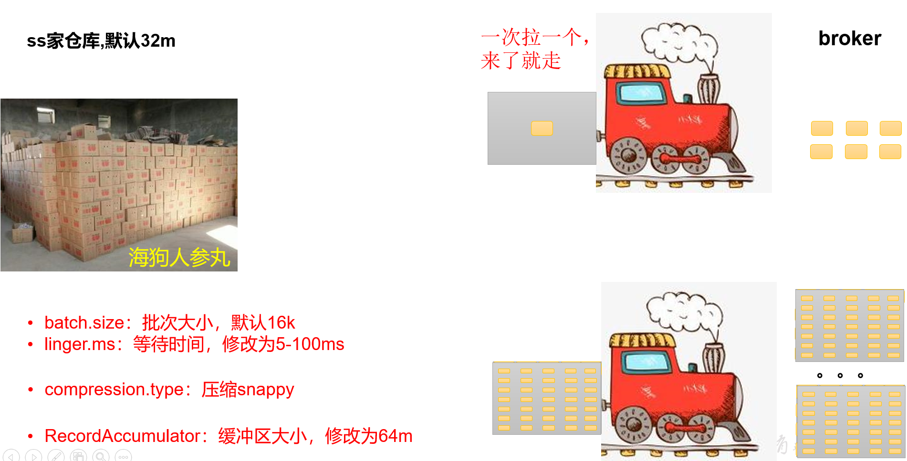

```java
public class CustomProducerParameters {

    public static void main(String[] args) {

        //0.配置
        Properties properties = new Properties();


        //1.创建生产者
        properties.put(ProducerConfig.BOOTSTRAP_SERVERS_CONFIG, "localhost:9092");

        // key,value序列化（必须）：key.serializer，value.serializer
        properties.put(ProducerConfig.KEY_SERIALIZER_CLASS_CONFIG, StringSerializer.class.getName());
        properties.put(ProducerConfig.VALUE_SERIALIZER_CLASS_CONFIG, StringSerializer.class.getName());

        //缓冲区大小
        properties.put(ProducerConfig.BUFFER_MEMORY_CONFIG,33554432);
        //批次大小
        properties.put(ProducerConfig.BATCH_SIZE_CONFIG,16384);
        // linger.ms
        properties.put(ProducerConfig.LINGER_MS_CONFIG,1);
        //压缩
        properties.put(ProducerConfig.COMPRESSION_TYPE_CONFIG,"snappy");
        // 3. 创建kafka生产者对象
        KafkaProducer<String, String> kafkaProducer = new KafkaProducer<String, String>(properties);
        // 4. 调用send方法,发送消息
        for (int i = 0; i < 5; i++) {

            kafkaProducer.send(new ProducerRecord<>("first","atguigu " + i));
        }
        // 5. 关闭资源
        kafkaProducer.close();
    }
}
```

## 四、发送消息可靠性

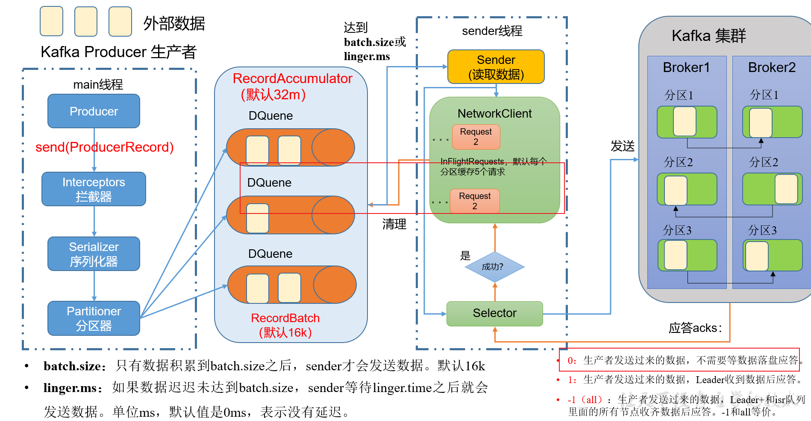

<font color='red'>**当Leader以及其flower 向sender发送ACK  队列才可以清除消息**</font>


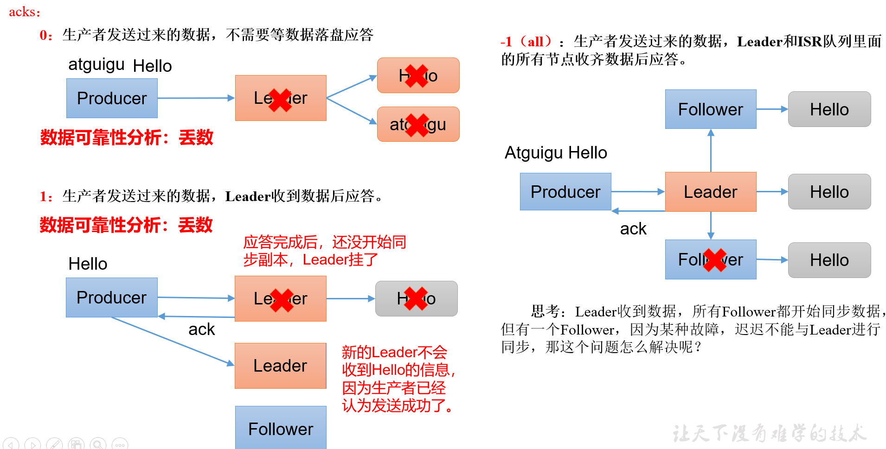

> 思考: <font color='red'>**Leader收到数据，所有follower都开始同步数据，但有一个Follower，因为某种故障，迟迟不能与Leader进行同步，那这个问题怎么解决？**</font>

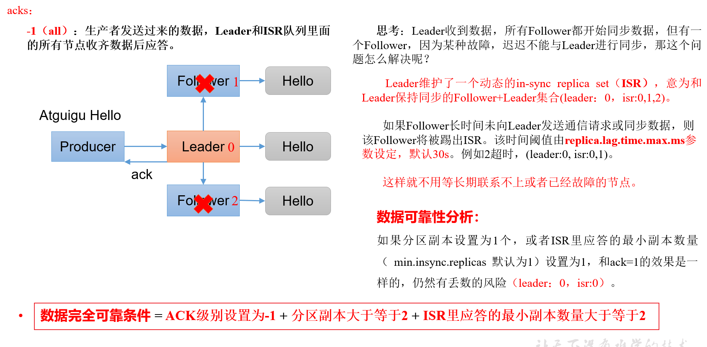

> 解决方法：<font color='red'>**Leader维护了一个动态的in-sync repica set （ISR），意为和Leader保持同步的Follower+Leader集合（leader：0，isr：0，1，2）**</font>。 如果Follower长时间未向Leader发送通信请求和同步数据，则该Follower将被踢出ISR，该时间阀值由replica.lag.time.ms参数设定，默认30s（leader：0，isr：0，1）。这样就不用等长期联系不上或者已经故障的节点了。


#### 可靠性总结

1. <font color='red'>acks= 0,生产者发送过来数据就不管了，可靠性差，效率高</font>
2. <font color='red'>acks= 1，生产者发送过来数据Leader应答，可靠性中等，效率中等，</font>
3. <font color='red'>acks= -1，生产者发送过来数据Leader和ISR队列里面所有Follower应答，可靠性高，效率低；</font>
4. <font color='red'>在生产环境中，acks=0很少使用；acks=1，一般用于传输普通日志，允许丢个别数据；acks= -1，一般用于传输和钱相关的数据，对可靠性要求比较高的场景。</font>


#### 缺点:重复消费

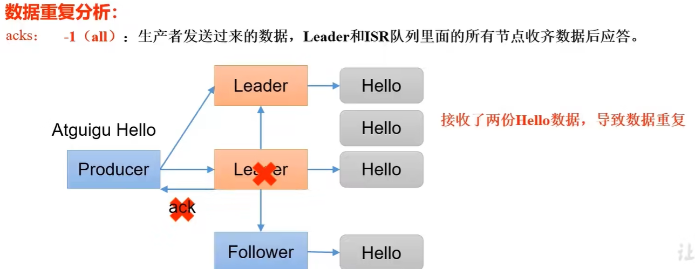

```java
public class CustomProducerAcks {
    public static void main(String[] args) throws ExecutionException, InterruptedException {

        // 0. 配置

        Properties properties = new Properties();
        //连接集群
        properties.put(ProducerConfig.BOOTSTRAP_SERVERS_CONFIG, "localhost:9092");

        // key,value序列化（必须）：key.serializer，value.serializer
        properties.put(ProducerConfig.KEY_SERIALIZER_CLASS_CONFIG, StringSerializer.class.getName());
        properties.put(ProducerConfig.VALUE_SERIALIZER_CLASS_CONFIG, StringSerializer.class.getName());

        // ACKs
      properties.put(ProducerConfig.ACKS_CONFIG,"1");
        //retry times
        properties.put(ProducerConfig.RETRIES_CONFIG,5);
        // 1. 创建kafka生产者对象
        KafkaProducer<String,String> kafkaProducer = new KafkaProducer<String, String>(properties);
        // 2. 发送数据
        for (int i = 0; i < 5; i++) {
            kafkaProducer.send(new ProducerRecord<>("first", "lyj" + i)).get();
        }
        // 3.关闭资源
        kafkaProducer.close();
    }
}
```


## 五、数据重复发送

- 至少一次（At Least once）= **ACK级别设置为-1 + 分区副本大于等于2 + ISR里应答的最小副本数量大于等于2**
- 最多一次（At Most Once） **= ACK级别设置为0**
- 总结：

- - at least once <font color='red'>**可以保证数据不丢失，但是不能保证数据不重复**</font>
  - at Most Once <font color='red'>**可以保证数据不重复，但是不能保证数据不丢失。**</font>

- 精确一次（Exactly Once） <font color='red'>**：对于一些非常重要的信息，比如钱有关的数据，要求数据既不能重复也不能丢失**</font>
- 

Kafka 0.11 版本后，引入了一项重大特效：<font color='red'>**幂等性和事务**</font>


### 1.幂等性原理

幂等性就是指Producer不论向Broker 发送多少次重复数据，Broker端只会持久化一条，保证了不重复。精确一次（Exactly Once） = 幂等性 +至少一次 （ack= -1 +分区副本数 >= 2 + ISR最小副本数量>= 2）。

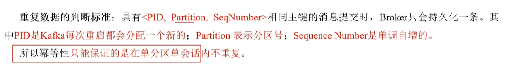

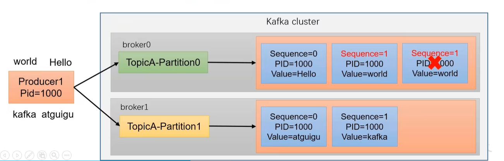

> 如何使用幂等性： 开启参数enable.idempotence 默认为true，false关闭

### 2.生产者事务

> **说明：开启事务，必须开启幂等性。**

<font color='red'>**producer在使用事务功能前，必须先自定义一个唯一的Transactional.id。**</font>有了transaction.id，即使客户端挂掉了，它重启后也能继续处理未完成的事务。（**事务协调器每个broker都有**）

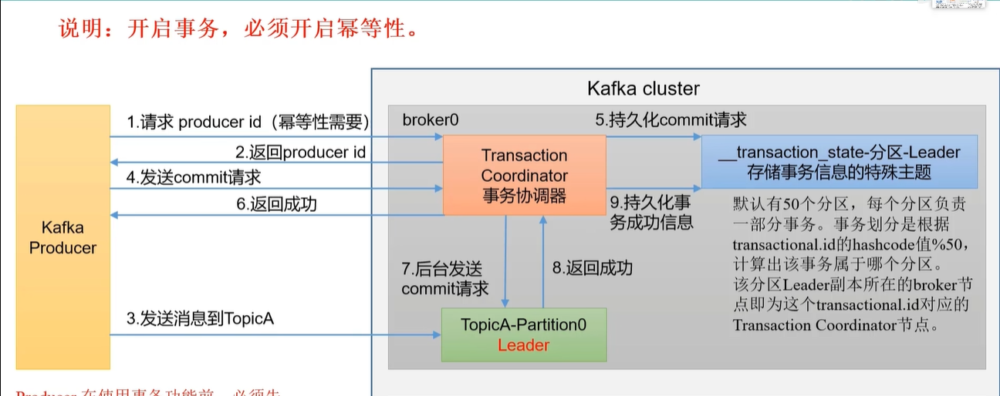

**kafka事务的五个API**

```java
// 1初始化事务
void initTransactions();

// 2开启事务
void beginTransaction() throws ProducerFencedException;

// 3在事务内提交已经消费的偏移量（主要用于消费者）
void sendOffsetsToTransaction(Map<TopicPartition, OffsetAndMetadata> offsets,
                              String consumerGroupId) throws ProducerFencedException;

// 4提交事务
void commitTransaction() throws ProducerFencedException;

// 5放弃事务（类似于回滚事务的操作）
void abortTransaction() throws ProducerFencedException;

```


### 3.事务原理

说明：开启事务，必须开启幂等性。

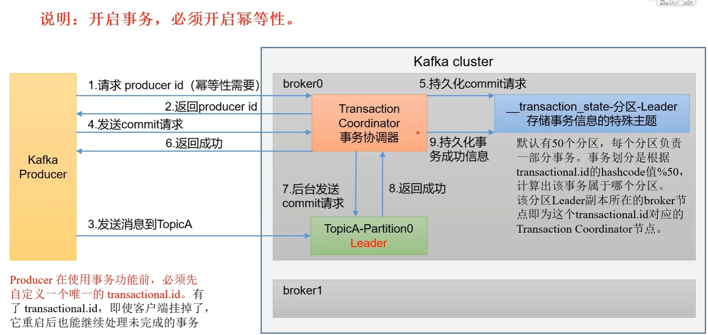


```java
public class CustomProducerTranactions {
    public static void main(String[] args) throws ExecutionException, InterruptedException {

        // 0. 配置

        Properties properties = new Properties();
        //连接集群
        properties.put(ProducerConfig.BOOTSTRAP_SERVERS_CONFIG, "localhost:9092");

        // key,value序列化（必须）：key.serializer，value.serializer
        properties.put(ProducerConfig.KEY_SERIALIZER_CLASS_CONFIG, StringSerializer.class.getName());
        properties.put(ProducerConfig.VALUE_SERIALIZER_CLASS_CONFIG, StringSerializer.class.getName());
        // 指定事务ID
        properties.put(ProducerConfig.TRANSACTIONAL_ID_CONFIG,"tranactional_id_01");

        // 1. 创建kafka生产者对象
        KafkaProducer<String,String> kafkaProducer = new KafkaProducer<String, String>(properties);

        kafkaProducer.initTransactions();

        kafkaProducer.beginTransaction();

        // 2. 发送数据
        try {
            for (int i = 0; i < 5; i++) {
                kafkaProducer.send(new ProducerRecord<>("first", "lyj" + i)).get();
            }
            // 出现异常
          // int i = 1/0;
            
            kafkaProducer.commitTransaction();
        }catch (Exception e){
            kafkaProducer.abortTransaction();
        }finally {
            // 3.关闭资源
            kafkaProducer.close();
        }
    }
}
```

## 六、数据有序

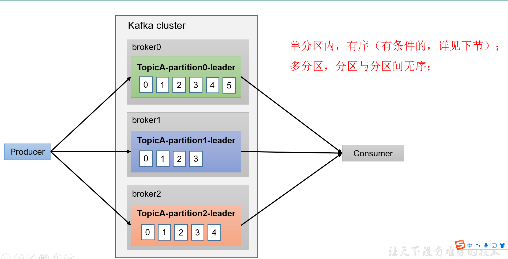


## 七、数据乱序

1. kafka在1.x版本之前保证数据单分区有序，条件如下：

max.in.flight.requests.per.connection = 1 （不需要考虑是否开启幂等性）

1. kafka在1.x及以后版本保证数据单分区有序，条件如下：
   1. 未开启幂等性  **max.in.flight.requests.per.connection 需要设置为1。**

   1. 开启幂等性   
      1. **max.in.flight.requests.per.connection 需要设置小于等于5**    

      1. 原因说明：因为在Kafka1.x以后，启用幂等后，kafka服务端会缓存producer发来的最近5个request的元数据，故无论如何，都可以保证最近5个request的数据都是有序的。


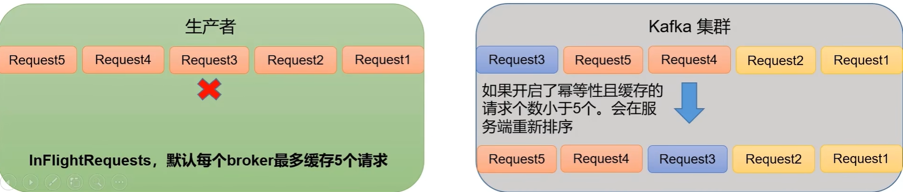
