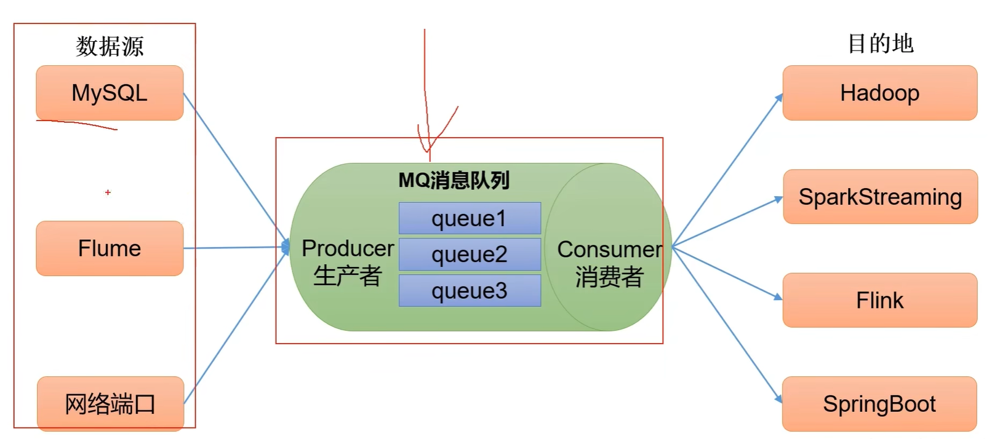
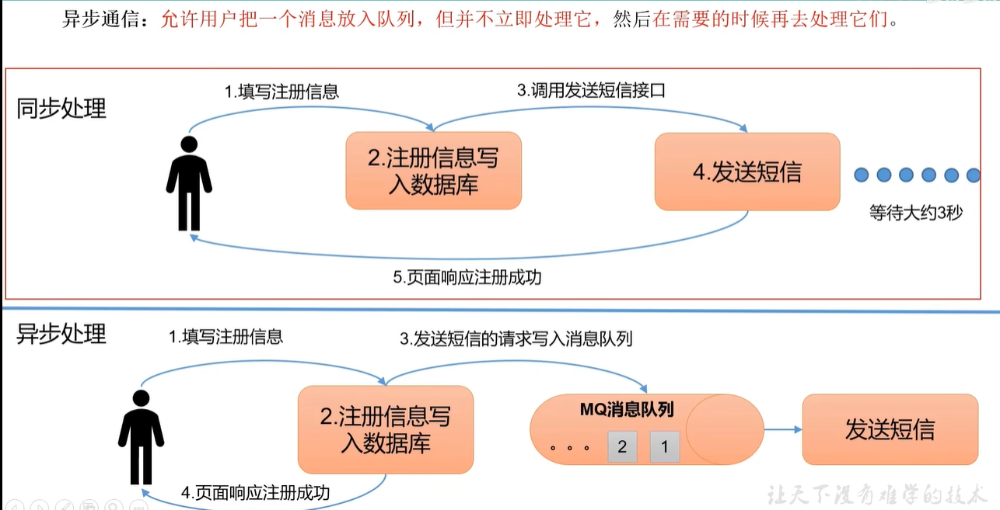
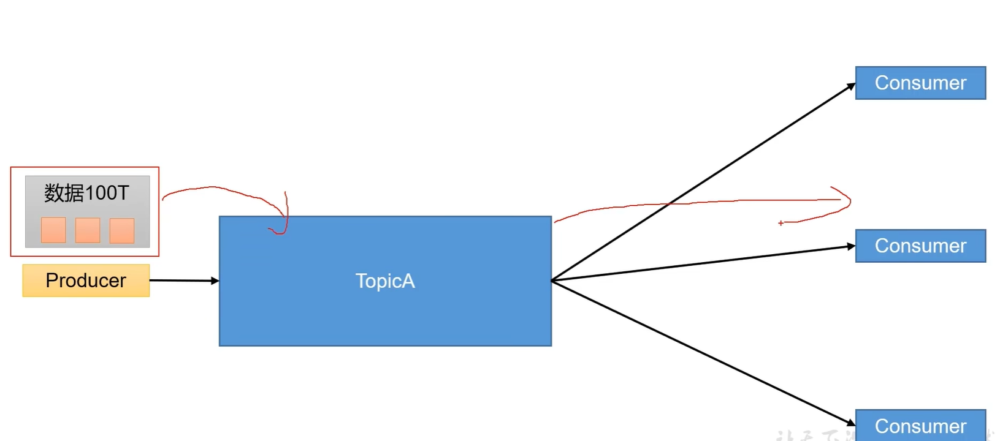
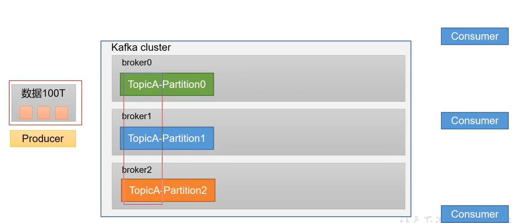
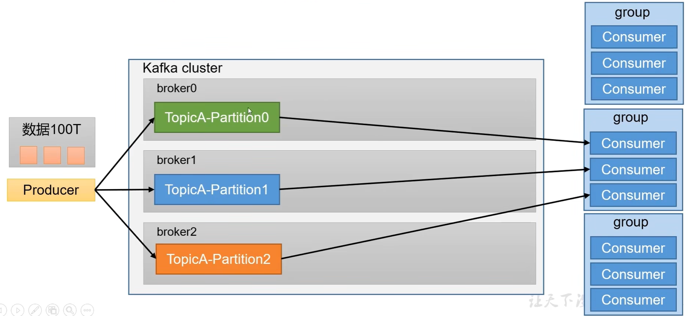
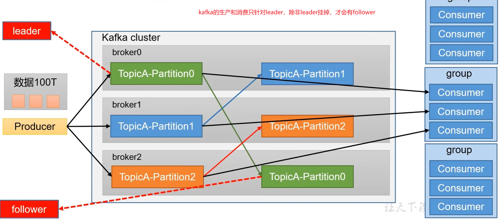
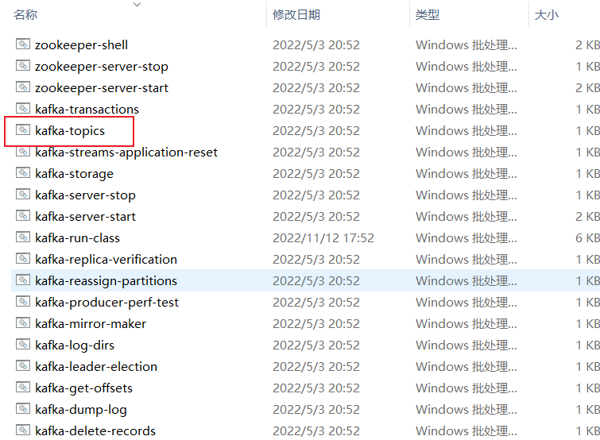
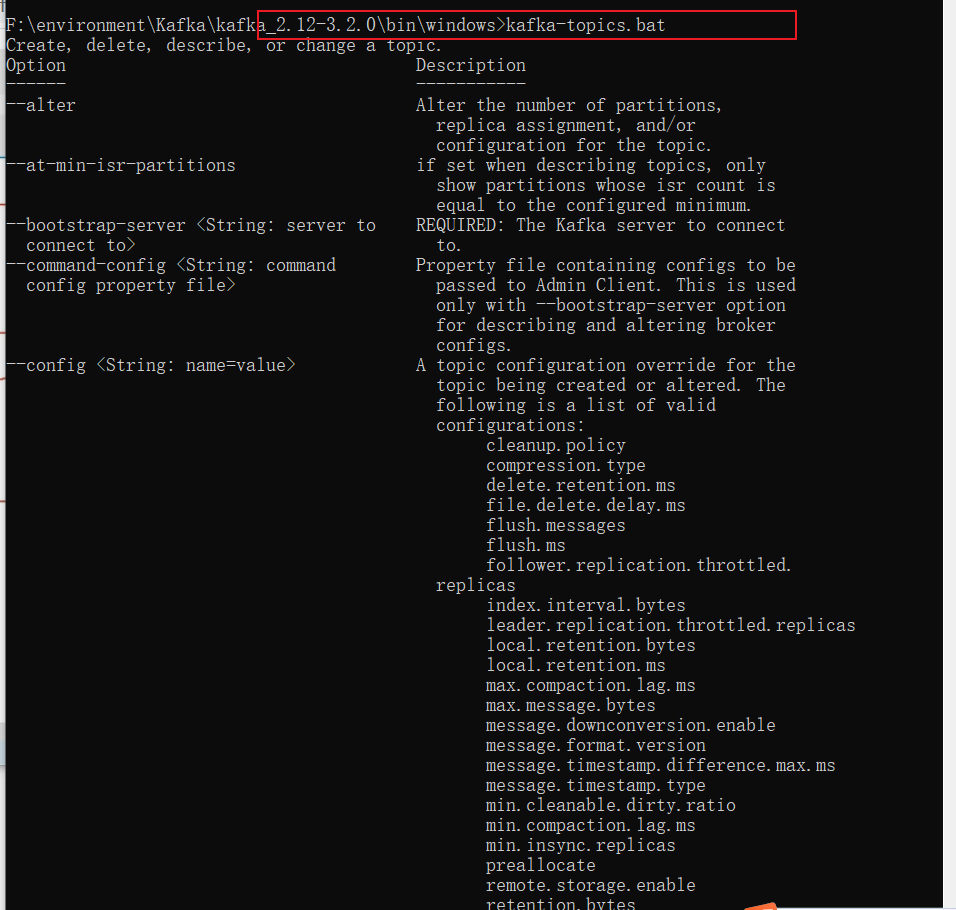
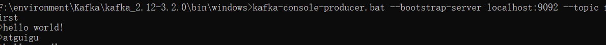
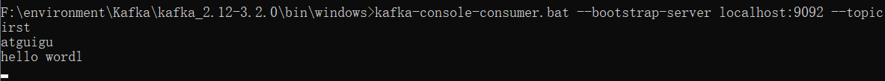

## 一、定义

Kafka传统定义：Kafka是一个**分布式**的基于**发布/订阅模式的消息队列**（Message Queue），主要应用于大数据实时处理领域。<br />发布/订阅：消息的发布者不会将消息直接发送给特定的订阅者，而是**将发布的消息分为不同的类别，**订阅者**只接收感兴趣的消息。**<br />**Kafka最新定义：<font color='red'> Kafka是一个开源的分布式事件流平台，被数千家公司用于高性能数据管道、流分析、数据集成和关键任务应用.</font>**

## 二、应用场景

### 1.缓冲消峰

有助于控制和优化数据流经过系统的速度，解决生产消息和消费消息的处理速度不一致的情况。

### 2.解耦

允许你独立的扩展或修改两边的处理过程，只要确保他们遵守同样的接口约束。<br />

### 3.异步通信

**允许用户把一个消息放入队列，但并不立即处理它**，然后**在需要的时候处理它们。**



## 三、消息队列的模式

### 1.点对点模式

- 消费者主动拉取数据 消息收到后清除消息

### 2.发布/订阅模式

- 可以有多个topic主题（游览、点赞、收藏、评论等）
- 消费者消费数据之后，不删除数据
- 每个消费者相互独立，都可以消费到数据


## 四、基础架构

假如我们Producer 生产了100T的数据， kafka存不下

1. **为方便扩展，并提供吞吐量，一个Topic分为多个partition**



2. **配合分区的设计，提出消费者组的概念，组内每个消费者并行消费**

<font color=red>**一个分区的数据只能由一个消费者组里的一个消费者消费**</font>

3. **为提供<font color='red'>可用性</font>，为每个partition增加若干副本，类似NameNode HA**



​	5.**ZK 中记录谁是leader，broker数量，isr的数量，Kafka2.8.0以后也可以配置不用ZK了**


## 五、Kafka安装

### 一、安装

[https://blog.csdn.net/GoodburghCottage/article/details/125896525](https://blog.csdn.net/GoodburghCottage/article/details/125896525)

### 二、命令行操作

#### 1.kafka-topic


**可以通过cmd输入命令查看参数**


```powershell
# 连接kafka
kafka-topics.bat --bootstarp-server localhost:9092
# 创建一个topic
kafka-topics.bat --bootstrap-server localhost:9092 --topic first --create --partitions 1 --replication-factor 1
# 查看topic
kafka-topics.bat --bootstarp-server localhost:9092 --list
# 查看topic 详情信息
kafka-topics.bat --bootstrap-server localhost:9092 --topic first  --describe
```

#### 2.kafka-console-producer

```powershell
# 生产消息
kafka-console-producer.bat --bootstrap-server localhost:9092 --topic first
```



#### 3.kafka-console-consumer

```powershell
#消费消息
kafka-console-consumer.bat --bootstrap-server localhost:9092 --topic first
# 消费以前的消息
kafka-console-consumer.bat --bootstrap-server localhost:9092 --topic first --from-beginning
```



注意：kafka消费消息是增量消费，不会消费以前的消息，除非加参数 


