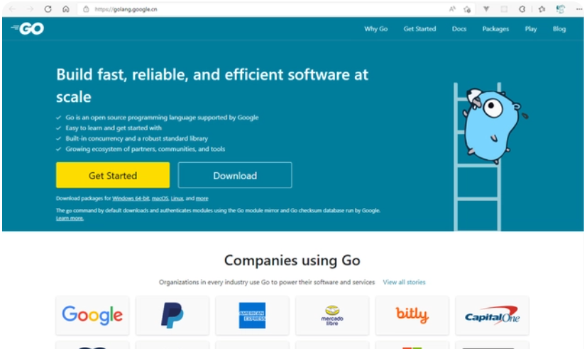

## 一、Go语言发展史

2007年，Google首席软件工程师Rob Pike与Robert Griesemer和Ken Thompson两位大师，决定创造一种新语言来取代C++，这就是Go语言。以下是Go语言的发展历程：

这里的发布时间都是正式版出来的时间。

- 2009 年 11 月 10 日，Go 语言以开放源代码的方式向全球发布。
- 2011 年 03 月 16 日，Go 语言的第一个稳定（stable）版本 R56 发布。
- 2012 年 03 月 28 日，Go 语言的第一个正式版本 Go 1 发布。
- 2013 年 04 月 04 日，Go 语言的 Go 1.1 beta1 测试版发布。
- 2013 年 04 月 08 日，Go 语言的 Go 1.1 beta2 测试版发布。
- 2013 年 05 月 02 日，Go 语言 Go 1.1 RC1 版发布。
- 2013 年 05 月 07 日，Go 语言 Go 1.1 RC2 版发布。
- 2013 年 05 月 09 日，Go 语言 Go 1.1 RC3 版发布。
- 2013 年 05 月 13 日，Go 语言 Go 1.1 正式版发布。
- 2013 年 09 月 20 日，Go 语言 Go 1.2 RC1 版发布。
- 2013 年 12 月 01 日，Go 语言 Go 1.2 正式版发布。
- 2014 年 06 月 18 日，Go 语言 Go 1.3 版发布。
- 2014 年 12 月 10 日，Go 语言 Go 1.4 版发布。
- 2015 年 08 月 19 日，Go 语言 Go 1.5 版发布，本次更新中移除了“最后残余的C代码”。
- 2016 年 02 月 17 日，Go 语言 Go 1.6 版发布。
- 2016 年 08 月 15 日，Go 语言 Go 1.7 版发布。
- 2017 年 02 月 17 日，Go 语言 Go 1.9 版发布。
- 2018 年 02 月 16 日，Go 语言 Go 1.10 版发布。
- 2018 年 08 月 25 日，Go 语言 Go 1.11 版发布。
- 2019 年 03 月 01 日，Go 语言 Go 1.12 版发布。
- 2019 年 09 月 03 日，Go 语言 Go 1.13 版发布。
- 2020 年 02 月 25 日，Go 语言 Go 1.14 版发布。
- 2020 年 08 月 12 日，Go 语言 Go 1.15 版本发布。
- 2021 年 02 月 17 日，Go 语言 Go 1.16 版本发布。
- 2021 年 08 月 17 日，Go 语言 Go 1.17 版本发布。
- 2022 年 03 月 15 日，Go 语言 Go 1.18 版本发布。

截止到 2022-06-01 日，当前最新版本的 Go 语言是 1.18.2 的版本。

学习肯定是按照这个学习了，有坑我们先踩了。毕竟我们正在精力当下。希望能够从零开始学一直成为源码贡献者。加入 contributions 一员。

Go 的官方网站，现在学习一个技术的最好方式就是官方网站的帮助文档， 如果这个技术够好， 够成熟， 已经有一个完善的帮助文档，比方说 Vue.js 的官方文档， 新版之后更加清爽了，学习起来更加方便了。 

Go 也可以称为 Golang。这样叫的原因， 可能是因为， 之前已经有 Go 语言，为了区分。也可能是为了更好的朗读。官方一开始也是这样定义的， 其中一个官网的访问网址就是 golang.google.cn。

### Go 的官方网站

地址： The Go Programming Language (google.cn) https://golang.google.cn/

或者： The Go Programming Language https://go.dev/

官网效果如下， 随着时间的更新可能有改版。

**Go语言的整个设计哲学就是：将简单、实用体现得淋漓尽致**